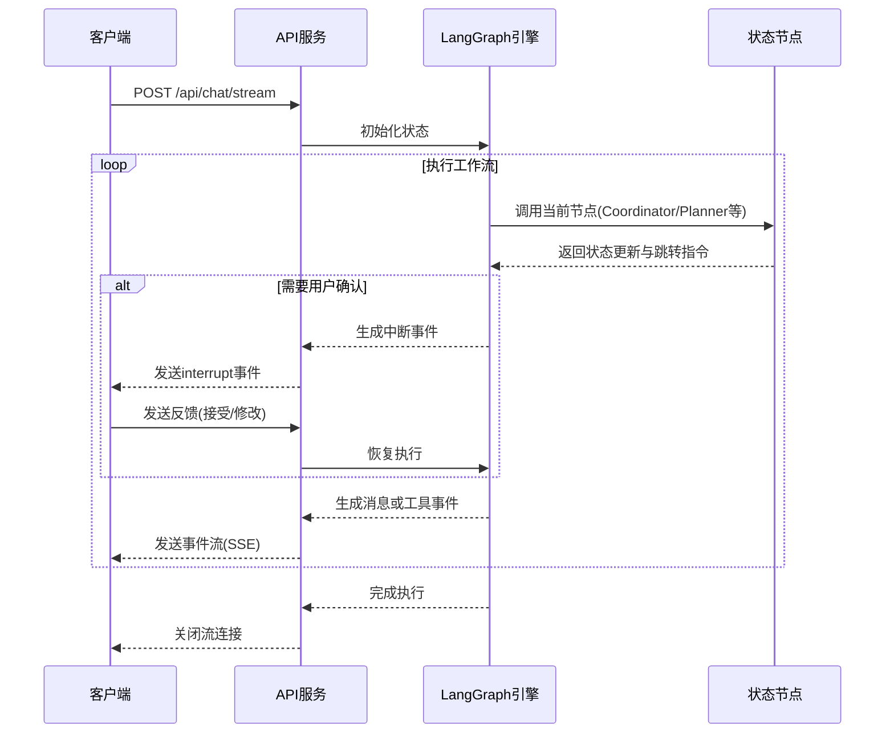
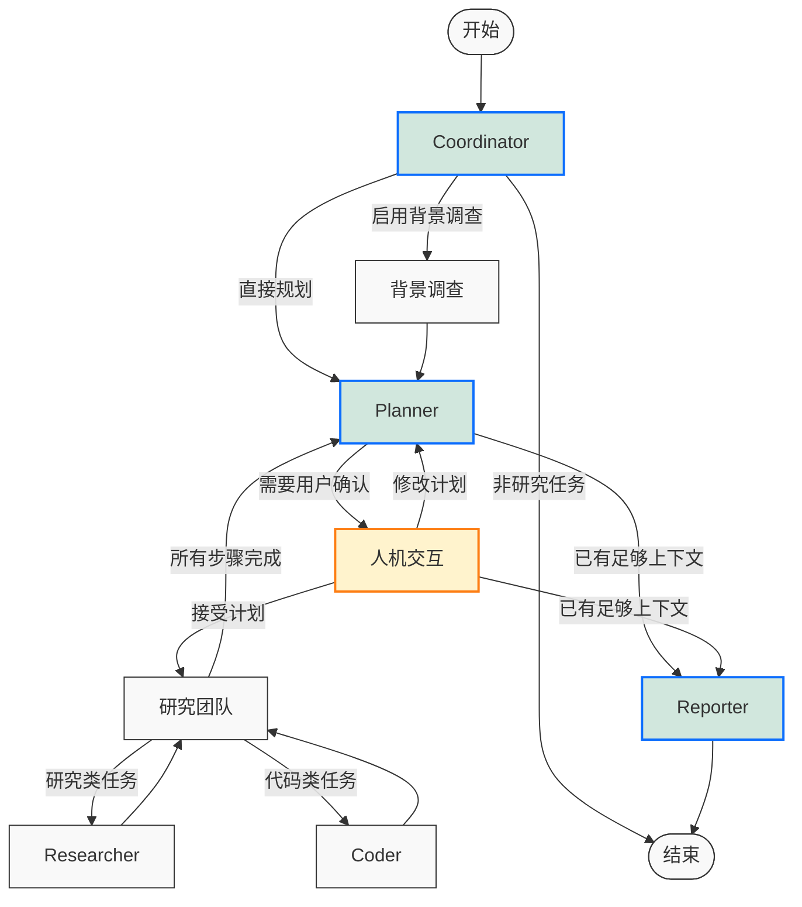

# DeerFlow API `/api/chat/stream` 接口核心流程分析

## 1. 接口概述

`/api/chat/stream` 是DeerFlow的核心API接口，用于启动基于LLM的深度研究流程并提供流式响应。它实现了Server-Sent Events (SSE)协议，支持人机协作的研究流程。

## 2. 接口定义

```python
@app.post("/api/chat/stream")
async def chat_stream(request: ChatRequest):
    # 处理会话ID，如果是默认ID则生成新的UUID
    thread_id = request.thread_id
    if thread_id == "__default__":
        thread_id = str(uuid4())
    
    # 返回流式响应
    return StreamingResponse(
        _astream_workflow_generator(
            request.model_dump()["messages"],  # 消息历史
            thread_id,                          # 会话ID
            request.max_plan_iterations,        # 最大计划迭代次数
            request.max_step_num,               # 最大步骤数
            request.auto_accepted_plan,         # 是否自动接受计划
            request.interrupt_feedback,         # 中断反馈
            request.mcp_settings,               # MCP设置
            request.enable_background_investigation, # 是否启用背景调查
        ),
        media_type="text/event-stream",        # SSE媒体类型
    )
```

## 3. 核心流程分析

### 3.1 流程图



### 3.2 事件流生成

```python
# _astream_workflow_generator函数核心逻辑
async def _astream_workflow_generator(...):
    # 1. 准备初始状态
    input_ = {
        "messages": messages,                     # 用户消息历史
        "plan_iterations": 0,                     # 计划迭代计数
        "final_report": "",                       # 最终报告
        "current_plan": None,                     # 当前计划
        "observations": [],                       # 观察结果列表
        "auto_accepted_plan": auto_accepted_plan, # 是否自动接受计划
        "enable_background_investigation": enable_background_investigation, # 是否启用背景调查
    }
    
    # 2. 处理中断恢复
    if not auto_accepted_plan and interrupt_feedback:
        resume_msg = f"[{interrupt_feedback}]"
        if messages:
            resume_msg += f" {messages[-1]['content']}"
        input_ = Command(resume=resume_msg)
    
    # 3. 异步流式执行工作流
    async for agent, _, event_data in graph.astream(
        input_,
        config={
            "thread_id": thread_id,
            "max_plan_iterations": max_plan_iterations,
            "max_step_num": max_step_num,
            "mcp_settings": mcp_settings,
        },
        stream_mode=["messages", "updates"],
        subgraphs=True,
    ):
        # 4. 处理中断事件
        if isinstance(event_data, dict) and "__interrupt__" in event_data:
            yield _make_event("interrupt", {...})
            continue
        
        # 5. 处理常规事件
        message_chunk, message_metadata = cast(tuple[AIMessageChunk, dict], event_data)
        
        # 6. 构建基本事件结构
        event_stream_message = {
            "thread_id": thread_id,
            "agent": agent[0].split(":")[0],
            "id": message_chunk.id,
            "role": "assistant",
            "content": message_chunk.content,
        }
        
        # 7. 根据消息类型生成不同的事件
        if isinstance(message_chunk, ToolMessage):
            # 工具消息事件
            yield _make_event("tool_call_result", {...})
        elif message_chunk.tool_calls:
            # 工具调用事件
            yield _make_event("tool_calls", {...})
        elif message_chunk.tool_call_chunks:
            # 工具调用片段事件
            yield _make_event("tool_call_chunks", {...})
        else:
            # 普通消息片段事件
            yield _make_event("message_chunk", event_stream_message)
```

### 3.3 关键节点说明

1. **Coordinator节点**：
   ```python
   # 分析用户输入，决定是否需要深度研究
   def coordinator_node(state: State) -> Command[...]:
       # 应用prompt模板
       messages = apply_prompt_template("coordinator", state)
       
       # 使用LLM分析用户查询
       response = get_llm_by_type(AGENT_LLM_MAP["coordinator"])
           .bind_tools([handoff_to_planner])
           .invoke(messages)
       
       # 决定下一步行动
       goto = "__end__"  # 默认结束
       if len(response.tool_calls) > 0:
           goto = "planner"  # 需要深度研究
           if state.get("enable_background_investigation"):
               goto = "background_investigator"  # 先进行背景调查
               
       return Command(goto=goto)
   ```

2. **Planner节点**：
   ```python
   # 生成研究计划
   def planner_node(state: State, config: RunnableConfig) -> Command[...]:
       # 准备输入
       messages = apply_prompt_template("planner", state, configurable)
       if state.get("background_investigation_results"):
           # 添加背景调查结果
           messages.append(...)
           
       # 生成计划
       full_response = llm.invoke(messages)
       
       # 解析计划
       curr_plan = json.loads(repair_json_output(full_response))
       
       # 决定下一步
       if curr_plan.get("has_enough_context"):
           # 已有足够上下文，直接生成报告
           return Command(goto="reporter")
       else:
           # 需要用户确认计划
           return Command(goto="human_feedback")
   ```

3. **Human Feedback节点**：
   ```python
   # 处理用户对计划的反馈
   def human_feedback_node(state) -> Command[...]:
       # 检查是否自动接受计划
       auto_accepted_plan = state.get("auto_accepted_plan", False)
       if not auto_accepted_plan:
           # 中断执行，等待用户反馈
           feedback = interrupt("Please Review the Plan.")
           
           # 处理用户反馈
           if feedback.startswith("[EDIT_PLAN]"):
               # 用户要修改计划，返回planner
               return Command(goto="planner")
           elif feedback.startswith("[ACCEPTED]"):
               # 用户接受计划，继续执行
               pass
       
       # 继续执行计划
       if new_plan["has_enough_context"]:
           goto = "reporter"  # 直接生成报告
       else:
           goto = "research_team"  # 执行研究
           
       return Command(goto=goto)
   ```

4. **Research Team节点**：
   ```python
   # 协调研究任务
   def research_team_node(state: State) -> Command[...]:
       # 检查计划完成情况
       for step in current_plan.steps:
           if not step.execution_res:
               # 找到未执行的步骤
               break
               
       # 根据步骤类型分配任务
       if step.step_type == StepType.RESEARCH:
           return Command(goto="researcher")  # 分配给研究员
       elif step.step_type == StepType.PROCESSING:
           return Command(goto="coder")  # 分配给程序员
           
       return Command(goto="planner")  # 所有步骤完成，返回planner
   ```

5. **Reporter节点**：
   ```python
   # 生成研究报告
   def reporter_node(state: State):
       # 准备输入
       invoke_messages = apply_prompt_template("reporter", input_)
       
       # 添加观察结果
       for observation in observations:
           invoke_messages.append(...)
           
       # 生成报告
       response = get_llm_by_type(AGENT_LLM_MAP["reporter"]).invoke(invoke_messages)
       
       # 返回最终报告
       return {"final_report": response.content}
   ```

## 4. 状态转换流程



## 5. 接口关键注释分析

### 5.1 初始化与配置

```python
# 1. 生成唯一会话ID
if thread_id == "__default__":
    thread_id = str(uuid4())

# 2. 配置工作流参数
config = {
    "thread_id": thread_id,               # 会话ID，用于状态持久化
    "max_plan_iterations": max_plan_iterations, # 限制计划迭代次数
    "max_step_num": max_step_num,         # 限制每个计划的步骤数
    "mcp_settings": mcp_settings,         # MCP工具集成配置
}

# 3. 流模式配置
stream_mode = ["messages", "updates"]     # 关注消息和状态更新
subgraphs = True                          # 支持子图执行
```

### 5.2 中断处理机制

```python
# 1. 检测中断事件
if "__interrupt__" in event_data:
    # 2. 构建中断事件
    interrupt_event = {
        "thread_id": thread_id,
        "id": event_data["__interrupt__"][0].ns[0],
        "role": "assistant",
        "content": event_data["__interrupt__"][0].value,
        "finish_reason": "interrupt",
        "options": [
            {"text": "Edit plan", "value": "edit_plan"},
            {"text": "Start research", "value": "accepted"},
        ],
    }
    
    # 3. 发送中断事件到客户端
    yield _make_event("interrupt", interrupt_event)

# 4. 处理中断恢复
if not auto_accepted_plan and interrupt_feedback:
    # 5. 构建恢复消息
    resume_msg = f"[{interrupt_feedback}]"
    if messages:
        resume_msg += f" {messages[-1]['content']}"
    
    # 6. 创建恢复命令
    input_ = Command(resume=resume_msg)
```

### 5.3 事件分类处理

```python
# 根据消息类型生成不同事件
if isinstance(message_chunk, ToolMessage):
    # 1. 工具消息 - 返回工具调用结果
    event_stream_message["tool_call_id"] = message_chunk.tool_call_id
    yield _make_event("tool_call_result", event_stream_message)
else:
    # 2. AI消息 - 分为三种类型
    if message_chunk.tool_calls:
        # 2.1 工具调用 - 完整工具调用信息
        event_stream_message["tool_calls"] = message_chunk.tool_calls
        yield _make_event("tool_calls", event_stream_message)
    elif message_chunk.tool_call_chunks:
        # 2.2 工具调用片段 - 流式工具调用过程
        event_stream_message["tool_call_chunks"] = message_chunk.tool_call_chunks
        yield _make_event("tool_call_chunks", event_stream_message)
    else:
        # 2.3 普通消息片段 - 文本内容
        yield _make_event("message_chunk", event_stream_message)
```

## 6. 最佳实践与说明

1. **会话管理**：
   - 保持thread_id一致以维持会话上下文
   - 使用auto_accepted_plan=true跳过人工确认适合自动化场景

2. **中断处理**：
   - 客户端需监听"interrupt"事件类型
   - 使用正确格式响应：[ACCEPTED]或[EDIT_PLAN] 修改建议

3. **性能考虑**：
   - 使用background_investigation减少LLM幻觉
   - 控制 max_plan_iterations 和max_step_num平衡深度和效率

4. **扩展集成**：
   - 通过mcp_settings配置扩展功能，添加特定领域工具
   - 可动态为研究员或程序员添加工具 