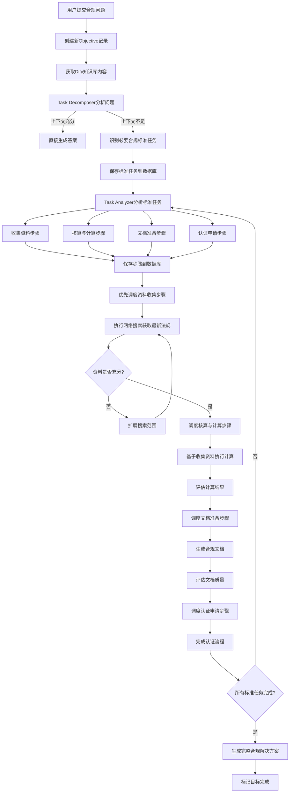

# DeerFlow任务调度与目标管理系统设计文档

## 1. 系统概述

本系统是基于DeerFlow框架的扩展应用，旨在实现一个能够管理和调度复杂研究目标的AI辅助系统。当用户提交研究问题（如"光伏组件出口法国需要完成哪些合规目标"）时，系统将自动分解为目标和任务，并通过调度机制保证各个目标和任务能够被正确、完整地执行。

## 2. 系统架构

系统采用混合架构设计，由以下几个主要部分组成：

### 2.1 核心组件

1. **任务管理服务（Task Management Service）**
   - 负责任务的创建、分解、调度和状态管理
   - 提供任务的持久化存储和状态跟踪
   - 实现任务超时检测和重试机制

2. **DeerFlow研究框架（扩展）**
   - 基于现有DeerFlow框架
   - 添加新的节点以支持任务分解和管理
   - 扩展State对象以包含任务相关信息

3. **数据库服务（Database Service）**
   - 存储任务、目标和步骤信息
   - 记录执行状态和结果
   - 支持任务恢复和历史查询

4. **Dify API集成服务**
   - 封装与Dify API的交互
   - 处理知识库检索和相关内容获取

5. **爬虫服务（Web Crawler Service）**
   - 按需获取补充信息
   - 支持特定领域的数据爬取

### 2.2 架构图

```
+-------------------+     +---------------------+     +-------------------+
|                   |     |                     |     |                   |
|    客户端/用户    +---->+  DeerFlow Web API   +---->+  任务管理服务    |
|                   |     |                     |     |                   |
+-------------------+     +---------------------+     +--------+----------+
                                                              |
                                                              v
+-------------------+     +---------------------+     +-------------------+
|                   |     |                     |     |                   |
|   爬虫服务        |<----+  扩展DeerFlow框架   |<----+   数据库服务     |
|                   |     |                     |     |                   |
+-------------------+     +---------------------+     +-------------------+
                                    ^
                                    |
                          +---------+---------+
                          |                   |
                          |   Dify API服务    |
                          |                   |
                          +-------------------+
```

## 3. 详细设计

### 3.1 mysql数据模型设计

#### 3.1.1 mysql数据库模型

1. **Objective（目标）表**
   ```sql
   CREATE TABLE objectives (
       objective_id UUID PRIMARY KEY,
       title TEXT NOT NULL,
       description TEXT,
       status TEXT NOT NULL, -- CREATED, IN_PROGRESS, COMPLETED, FAILED
       created_at TIMESTAMP NOT NULL,
       updated_at TIMESTAMP NOT NULL,
       completed_at TIMESTAMP,
       retry_count INTEGER DEFAULT 0,
       max_retries INTEGER DEFAULT 3
   );
   ```

2. **Task（任务）表**
   ```sql
   CREATE TABLE tasks (
       task_id UUID PRIMARY KEY,
       objective_id UUID REFERENCES objectives(objective_id),
       title TEXT NOT NULL,
       description TEXT,
       status TEXT NOT NULL, -- PENDING, IN_PROGRESS, COMPLETED, FAILED
       priority INTEGER DEFAULT 0,
       created_at TIMESTAMP NOT NULL,
       updated_at TIMESTAMP NOT NULL,
       completed_at TIMESTAMP,
       is_sufficient BOOLEAN DEFAULT FALSE,
       evaluation_criteria TEXT,
       retry_count INTEGER DEFAULT 0,
       max_retries INTEGER DEFAULT 3
   );
   ```

3. **Step（步骤）表**
   ```sql
   CREATE TABLE steps (
       step_id UUID PRIMARY KEY,
       task_id UUID REFERENCES tasks(task_id),
       title TEXT NOT NULL,
       description TEXT,
       status TEXT NOT NULL, -- PENDING, IN_PROGRESS, COMPLETED, FAILED
       priority INTEGER DEFAULT 0,
       created_at TIMESTAMP NOT NULL,
       updated_at TIMESTAMP NOT NULL,
       completed_at TIMESTAMP,
       is_sufficient BOOLEAN DEFAULT FALSE,
       evaluation_criteria TEXT,
       retry_count INTEGER DEFAULT 0,
       max_retries INTEGER DEFAULT 3,
       timeout_seconds INTEGER DEFAULT 300
   );
   ```

4. **Content（内容）表**
   ```sql
   CREATE TABLE contents (
       content_id UUID PRIMARY KEY,
       reference_id UUID NOT NULL, -- 关联到task_id或step_id
       reference_type TEXT NOT NULL, -- 'TASK'或'STEP'
       content_type TEXT NOT NULL, -- 'DIFY_KNOWLEDGE', 'CRAWLED_DATA', 'AGENT_RESULT'
       content TEXT,
       metadata JSONB,
       created_at TIMESTAMP NOT NULL
   );
   ```

5. **Schedule（调度）表**
   ```sql
   CREATE TABLE schedules (
       schedule_id UUID PRIMARY KEY,
       reference_id UUID NOT NULL, -- 关联到objective_id, task_id或step_id
       reference_type TEXT NOT NULL, -- 'OBJECTIVE', 'TASK'或'STEP'
       status TEXT NOT NULL, -- SCHEDULED, RUNNING, COMPLETED, FAILED
       scheduled_at TIMESTAMP NOT NULL,
       started_at TIMESTAMP,
       completed_at TIMESTAMP,
       retry_count INTEGER DEFAULT 0,
       error_message TEXT
   );
   ```

6. **BusinessAnalysis（业务分析）表**
   ```sql
   CREATE TABLE business_analyses (
       analysis_id UUID PRIMARY KEY,
       objective_id UUID REFERENCES objectives(objective_id),
       industry_type TEXT NOT NULL,  -- 行业类型，如"光伏"、"医疗"等
       business_scenario TEXT NOT NULL,  -- 业务场景，如"国际贸易"、"产品认证"等
       key_business_drivers TEXT[],  -- 关键业务驱动因素
       business_constraints TEXT[],  -- 业务约束条件
       analysis_result TEXT,  -- 业务分析结果
       relevant_regulations TEXT[],  -- 相关法规列表
       market_requirements TEXT[],  -- 市场要求
       stakeholders TEXT[],  -- 利益相关方
       business_risks TEXT[],  -- 业务风险
       created_at TIMESTAMP NOT NULL,
       updated_at TIMESTAMP NOT NULL
   );
   ```

7. **IndustryStandard（行业标准）表**
   ```sql
   CREATE TABLE industry_standards (
       standard_id UUID PRIMARY KEY,
       industry_type TEXT NOT NULL,
       standard_name TEXT NOT NULL,
       standard_code TEXT,
       description TEXT,
       issuing_authority TEXT,
       effective_date DATE,
       expiration_date DATE,
       regions TEXT[],  -- 适用区域
       categories TEXT[],  -- 标准类别
       metadata JSONB,
       created_at TIMESTAMP NOT NULL,
       updated_at TIMESTAMP NOT NULL
   );
   ```

#### 3.1.2 对象模型设计

```python
# 目标状态枚举
class ObjectiveStatus(str, Enum):
    CREATED = "CREATED"
    IN_PROGRESS = "IN_PROGRESS"
    COMPLETED = "COMPLETED"
    FAILED = "FAILED"

# 任务/步骤状态枚举
class WorkStatus(str, Enum):
    PENDING = "PENDING"
    IN_PROGRESS = "IN_PROGRESS"
    COMPLETED = "COMPLETED"
    FAILED = "FAILED"

# 内容类型枚举
class ContentType(str, Enum):
    DIFY_KNOWLEDGE = "DIFY_KNOWLEDGE"
    CRAWLED_DATA = "CRAWLED_DATA"
    AGENT_RESULT = "AGENT_RESULT"

# 步骤类型枚举
class StepType(str, Enum):
    RESEARCH = "RESEARCH"  # 需要搜索、收集数据的研究型步骤
    PROCESSING = "PROCESSING"  # 处理已有数据的计算型步骤

# 目标模型
class Objective(BaseModel):
    objective_id: UUID
    title: str
    description: Optional[str] = None
    status: ObjectiveStatus
    created_at: datetime
    updated_at: datetime
    completed_at: Optional[datetime] = None
    retry_count: int = 0
    max_retries: int = 3
    locale: str = "zh-CN"  # 用户语言区域
    
# 任务模型
class Task(BaseModel):
    task_id: UUID
    objective_id: UUID
    title: str
    description: Optional[str] = None
    status: WorkStatus
    priority: int = 0
    created_at: datetime
    updated_at: datetime
    completed_at: Optional[datetime] = None
    is_sufficient: bool = False
    evaluation_criteria: Optional[str] = None
    retry_count: int = 0
    max_retries: int = 3
    analysis_framework: Optional[str] = None  # 分析框架，描述任务解析的方法论

# 步骤模型
class Step(BaseModel):
    step_id: UUID
    task_id: UUID
    title: str
    description: Optional[str] = None
    status: WorkStatus
    priority: int = 0
    created_at: datetime
    updated_at: datetime
    completed_at: Optional[datetime] = None
    is_sufficient: bool = False
    evaluation_criteria: Optional[str] = None
    retry_count: int = 0
    max_retries: int = 3
    timeout_seconds: int = 300
    step_type: StepType = StepType.RESEARCH  # 步骤类型：研究型或处理型
    need_web_search: bool = True  # 是否需要网络搜索获取额外数据
    execution_result: Optional[str] = None  # 步骤执行结果
```

### 3.2 扩展DeerFlow框架

#### 3.2.1 新增节点

1. **Objective Decomposer节点（Agent1）**
   - 功能：分析用户问题，基于多维度分析框架分解为一级研究目标
   - 输入：用户查询、Dify知识库内容、locale(语言区域)
   - 输出：结构化目标列表，每个目标包含：
     - 标题
     - 描述
     - 分析框架
     - 是否已有足够上下文
     - 评估标准
   - 处理逻辑：
     1. 使用DeerFlow的分析框架评估上下文是否充分
     2. 对不充分的方面，通过多维度分析（历史背景、现状分析、未来展望等）分解目标
     3. 为每个目标生成明确的评估标准
     4. 设置优先级和依赖关系

2. **Task Analyzer节点（Agent2）**
   - 功能：将每个一级研究目标进一步分解为具体任务
   - 输入：研究目标、分析框架、相关Dify知识库内容
   - 输出：结构化任务列表，每个任务包含：
     - 标题
     - 描述
     - 步骤类型（RESEARCH或PROCESSING）
     - 是否需要网络搜索
     - 评估标准
     - 预计超时时间
   - 处理逻辑：
     1. 根据目标的分析框架，将目标分解为研究型(RESEARCH)和处理型(PROCESSING)任务
     2. 研究型任务用于信息收集（设置need_web_search=true）
     3. 处理型任务用于数据处理和计算（设置need_web_search=false）
     4. 为每个任务生成精确的描述和评估标准
     5. 设置任务的优先级和逻辑依赖关系

3. **Sufficiency Evaluator节点**
   - 功能：严格评估任务/步骤的内容是否足够完整
   - 输入：任务/步骤内容、评估标准
   - 输出：
     - 是否足够的判断结果（布尔值）
     - 详细理由说明
     - 如果不足，指出缺失的具体信息点
   - 处理逻辑：
     1. 应用严格的充分性标准，检查信息是否全面、最新、可靠
     2. 验证是否存在信息缺口、不明确之处或矛盾
     3. 评估数据点是否有可靠来源支持
     4. 判断信息量是否足以支撑一份全面的结果

4. **Completion Evaluator节点**
   - 功能：评估任务/步骤的执行结果是否满足预定标准
   - 输入：步骤的执行结果、评估标准
   - 输出：
     - 完成质量评分（0-100）
     - 评估结果详情
     - 改进建议（如有）
   - 处理逻辑：
     1. 根据步骤的评估标准检查执行结果
     2. 评估结果的质量、全面性和准确性
     3. 计算总体评分并提供详细评估报告
     4. 如有必要，提出改进建议或标记为需要重试

5. **Business Analyzer节点**
   - 功能：分析用户业务需求，识别行业特点和业务场景
   - 输入：用户查询、Dify知识库内容、locale(语言区域)
   - 输出：业务分析结果，包含：
     - 行业类型
     - 业务场景
     - 关键业务驱动因素
     - 业务约束条件
     - 相关法规和标准
     - 市场需求
     - 利益相关方
     - 业务风险
   - 处理逻辑：
     1. 识别用户查询涉及的业务领域和场景
     2. 检索相关行业标准和法规信息
     3. 分析业务约束条件和相关风险
     4. 识别关键利益相关方及其需求
     5. 生成综合业务分析报告
     6. 将分析结果保存到数据库并更新状态

#### 3.2.2 扩展State类型

```python
class EnhancedState(State):
    """扩展DeerFlow的State类，添加目标管理相关字段。"""
    
    # 基础设置
    locale: str = "zh-CN"  # 用户语言区域
    enable_background_investigation: bool = True  # 是否启用背景调查
    
    # 目标相关
    current_objective_id: Optional[UUID] = None
    current_objective_title: Optional[str] = None
    objective_description: Optional[str] = None
    objective_status: Optional[str] = None
    
    # 任务相关
    current_task_id: Optional[UUID] = None
    current_task_title: Optional[str] = None
    current_task_analysis_framework: Optional[str] = None
    tasks: List[Dict] = []
    
    # 步骤相关
    current_step_id: Optional[UUID] = None
    current_step_title: Optional[str] = None
    current_step_type: Optional[str] = None  # "RESEARCH" 或 "PROCESSING"
    current_step_need_web_search: bool = False
    steps: List[Dict] = []
    
    # 评估相关
    evaluation_result: Optional[Dict] = None
    content_sufficient: Optional[bool] = None
    sufficiency_reason: Optional[str] = None
    
    # 业务分析相关
    current_analysis_id: Optional[UUID] = None
    industry_type: Optional[str] = None  # 行业类型，如"光伏"、"医疗"等
    business_scenario: Optional[str] = None  # 业务场景，如"国际贸易"、"产品认证"等
    business_analysis_result: Optional[Dict] = None  # 业务分析结果
    relevant_standards: List[Dict] = []  # 相关标准列表
    business_constraints: List[str] = []  # 业务约束条件
    business_risks: List[Dict] = []  # 业务风险
    market_analysis: Optional[Dict] = None  # 市场分析结果
    stakeholders: List[Dict] = []  # 利益相关方
    
    # 执行相关
    current_plan: Dict = {}  # 当前执行计划
    plan_iterations: int = 0  # 计划迭代次数
    observations: List[str] = []  # 执行过程中的观察结果
    background_investigation_results: Optional[str] = None  # 背景调查结果
    
    # 结果相关
    execution_results: Dict[str, str] = {}  # 步骤执行结果，键为step_id
    final_report: Optional[str] = None  # 最终报告内容
```

#### 3.2.3 任务分解分析框架

系统采用以标准与合规要求为主线的任务分解方法，确保对复杂研究问题（如"光伏组件出口法国问题"）进行全面的分析和规划。这种分解方法特别适用于国际贸易、合规认证、产品标准等领域的问题。

1. **目标分解为任务（Tasks）**
   
   在这种分解方法中，系统将用户的主要目标（如"光伏组件出口法国"）分解为多个具体的标准或合规任务，每个任务代表一项必须满足的要求或标准，例如：
   
   - **碳足迹认证任务**：满足法国PPE2对光伏产品的碳足迹要求
   - **碳边境调节机制（CBAM）合规任务**：符合欧盟CBAM的申报与缴费要求
   - **《新电池法案》合规任务**：满足欧盟对电池产品的环保与可持续性要求
   - **法国光伏招标资质任务**：获得参与法国光伏招标的必要资质
   - **产品标准合规任务**：满足欧盟与法国对光伏产品的技术与质量标准

   每个任务包含以下要素：
   - 任务标题（如"碳足迹认证"）
   - 详细描述（该任务的具体要求和意义）
   - 法规依据（如"法国PPE2文件"）
   - 达成标准（量化或明确的评判标准）
   - 优先级（基于重要性和时间紧迫度）

2. **任务分解为步骤（Steps）**

   每个合规/标准任务进一步分解为具体的执行步骤，步骤设计遵循以下模式：
   
   a. **第一步通常是信息收集**：
      - 收集相关法规、标准和要求的详细资料
      - 研究法规的最新更新和解释文件
      - 获取成功案例和行业最佳实践
   
   b. **后续步骤根据特定标准/合规要求定制**：
      - 核算与计算步骤（如碳足迹计算）
      - 文档准备步骤（如准备申报材料）
      - 测试与验证步骤（如产品性能测试）
      - 认证申请步骤（如提交认证申请）
      - 改进优化步骤（如降低产品碳排放）
   
   每个步骤包含：
   - 步骤标题（如"收集法国碳足迹要求资料"）
   - 详细描述（明确具体任务内容）
   - 步骤类型（RESEARCH或PROCESSING）
   - 是否需要网络搜索（通常第一步需要）
   - 预期产出（明确交付物）
   - 评估标准（如何判断步骤是否完成）

3. **光伏组件出口法国的示例分解**

   以下是针对"光伏组件出口法国"问题的目标与任务分解示例：

   **任务1：碳足迹认证**
   - 步骤1.1：收集法国PPE2关于光伏碳足迹的最新要求（RESEARCH，需要网络搜索）
   - 步骤1.2：分析企业产品全生命周期碳排放情况（PROCESSING，不需要网络搜索）
   - 步骤1.3：根据ECS方法计算产品碳足迹值（PROCESSING，不需要网络搜索）
   - 步骤1.4：准备碳足迹声明文件（PROCESSING，不需要网络搜索）
   - 步骤1.5：申请第三方认证机构验证（RESEARCH，需要网络搜索）

   **任务2：CBAM合规**
   - 步骤2.1：收集欧盟CBAM最新规定与实施细则（RESEARCH，需要网络搜索）
   - 步骤2.2：评估产品在CBAM下的碳关税成本（PROCESSING，不需要网络搜索）
   - 步骤2.3：准备CBAM申报所需数据与文件（PROCESSING，不需要网络搜索）
   - 步骤2.4：设计CBAM成本优化方案（PROCESSING，不需要网络搜索）

   **任务3：法国光伏招标资质准备**
   - 步骤3.1：研究法国能源监管委员会招标要求（RESEARCH，需要网络搜索）
   - 步骤3.2：分析招标评分体系与碳足迹权重（PROCESSING不需要网络搜索）
   - 步骤3.3：准备参与招标所需企业资质文件（PROCESSING，不需要网络搜索）
   - 步骤3.4：编制符合法国要求的投标文件（PROCESSING，不需要网络搜索）

**分析框架应用流程**：

1. **目标分解阶段**：
   - Objective Decomposer节点根据用户查询的性质，识别必须满足的关键标准与合规要求
   - 将每个标准/合规要求转化为一个明确的任务（Task）
   - 为每个任务设置优先级，基于法规重要性、时间紧迫度和依赖关系

2. **任务分解阶段**：
   - Task Analyzer节点将每个标准/合规任务分解为具体实施步骤
   - 确保第一步始终是收集该任务相关的最新、全面资料
   - 后续步骤根据具体标准要求来设计，确保覆盖从分析、准备到实施的完整流程
   - 明确区分研究型步骤(RESEARCH)和处理型步骤(PROCESSING)

3. **执行策略**：
   - 优先执行资料收集步骤，建立知识基础
   - 基于收集的信息，执行数据处理和分析步骤
   - 生成必要的合规文档和申请材料
   - 提供具体的实施和优化建议

通过这种基于标准与合规要求的分解方法，系统能够为用户提供清晰、系统化的出口合规解决方案，确保所有必要的标准和要求都得到全面满足。

### 3.3 任务管理服务设计

#### 3.3.1 主要组件

1. **TaskManager类**
   - 负责创建、更新和管理任务
   - 与数据库交互保存任务状态
   - 提供任务查询和状态更新接口

2. **TaskDecomposer类**
   - 调用DeerFlow框架分解任务
   - 创建并保存目标到数据库

3. **TaskAnalyzer类**
   - 分析目标，生成步骤
   - 保存步骤到数据库

4. **Scheduler类**
   - 管理任务、目标和步骤的调度
   - 检测超时和失败情况
   - 实现重试机制

5. **EvaluationService类**
   - 评估内容是否足够
   - 评估任务/步骤是否完成


#### 3.3.2 任务流程设计

系统采用以标准与合规要求为主线的任务流程设计，确保对复杂贸易合规问题（如"光伏组件出口法国"）进行系统化的处理。流程全面集成了DeerFlow的上下文评估方法，保证对各项合规标准的全面覆盖。



**详细流程说明**：

1. **目标分析阶段**
   - Task Decomposer节点分析用户的合规问题和可用上下文
   - 应用严格的上下文充分性标准（借鉴DeerFlow方法）：
     ```
     a. 如当前信息完全回答了所有合规要求
     b. 信息全面、最新且来自可靠来源
     c. 没有法规缺口或不清晰之处
     d. 所有要求有明确的实施步骤
     e. 信息量足够支撑完整合规方案
     ```
   - 如果上下文充分，直接生成答案并完成目标
   - 如果上下文不足（多数情况），识别必须满足的关键标准与合规要求：
     - 将每个标准/合规要求转化为一个任务（Task）
     - 设置任务优先级，基于法规重要性与时间紧迫度
     - 保存Task记录，状态设为PENDING

2. **标准任务分解阶段**
   - 对每个标准任务，获取相关Dify知识库内容补充上下文
   - Task Analyzer节点将标准任务分解为具体执行步骤：
     ```
     a. 第一步始终是信息收集步骤（设置为RESEARCH类型）
     b. 后续步骤根据标准要求设计（核算、文档准备、认证等）
     c. 明确区分研究型(RESEARCH)和处理型(PROCESSING)步骤
     d. 为每个步骤设置明确的预期产出和评估标准
     ```
   - 保存Step记录，状态设为PENDING
   - 将Task状态更新为IN_PROGRESS

3. **步骤执行阶段**
   - Scheduler优先调度资料收集类步骤，建立知识基础
   - 对每个Step：
     ```
     a. 更新Step状态为IN_PROGRESS
     b. 对于RESEARCH类型步骤，执行网络搜索获取最新资料
     c. 对于PROCESSING类型步骤，使用已收集的资料进行处理
     d. 保存执行结果到execution_result字段
     e. 评估执行结果是否满足预期标准
     f. 如结果不满足标准且未超过重试次数，安排重试
     g. 更新Step状态（COMPLETED或FAILED）
     ```
   - 当所有步骤完成后，评估标准任务是否达成

4. **合规方案生成阶段**
   - 当所有标准任务完成后，系统整合各任务的执行结果
   - 生成完整的合规解决方案，包括：
     ```
     a. 所有必要标准与合规要求的清单
     b. 每项要求的具体实施步骤和方法
     c. 准备材料与文档的模板或示例
     d. 成本和资源估算
     e. 时间规划与关键节点
     ```
   - 将Task标记为COMPLETED，提供最终解决方案给用户

通过这种基于标准与合规要求的任务流程设计，系统能够为用户提供系统化、全面的国际贸易合规解决方案，确保所有必要的标准和要求都得到充分满足，并提供明确的实施路径。

### 3.4 Dify API集成服务

#### 3.4.1 主要接口

1. **知识库检索接口**
   - 功能：根据查询获取相关知识库内容
   - 输入：查询文本
   - 输出：相关知识库内容列表

#### 3.4.2 实现类

```python
class DifyService:
    """Dify API集成服务类"""
    
    def __init__(self, api_key: str, base_url: str):
        self.api_key = api_key
        self.base_url = base_url
        self.session = requests.Session()
        self.session.headers.update({
            "Authorization": f"Bearer {api_key}",
            "Content-Type": "application/json"
        })
    
    async def get_knowledge(self, query: str) -> List[Dict]:
        """获取与查询相关的知识库内容"""
        endpoint = f"{self.base_url}/knowledge/search"
        response = await self.session.post(endpoint, json={"query": query})
        response.raise_for_status()
        return response.json()["data"]
```

### 3.5 爬虫服务设计

#### 3.5.1 主要接口

1. **通用网页爬取接口**
   - 功能：爬取指定URL的网页内容
   - 输入：URL
   - 输出：网页内容和元数据

2. **关键词搜索爬取接口**
   - 功能：搜索关键词并爬取相关网页
   - 输入：关键词、爬取数量限制
   - 输出：爬取内容列表

#### 3.5.2 实现类

```python
class WebCrawlerService:
    """网页爬虫服务类"""
    
    def __init__(self, proxy_config: Optional[Dict] = None):
        self.session = requests.Session()
        if proxy_config:
            self.session.proxies.update(proxy_config)
    
    async def crawl_url(self, url: str) -> Dict:
        """爬取指定URL的内容"""
        response = await self.session.get(url)
        response.raise_for_status()
        
        soup = BeautifulSoup(response.text, 'html.parser')
        
        # 提取正文内容
        content = self._extract_main_content(soup)
        
        return {
            "url": url,
            "title": soup.title.text if soup.title else "",
            "content": content,
            "timestamp": datetime.now().isoformat()
        }
    
    async def search_and_crawl(self, keyword: str, limit: int = 5) -> List[Dict]:
        """搜索关键词并爬取结果"""
        # 使用搜索引擎API或爬取搜索结果页面
        search_results = await self._search(keyword, limit)
        
        # 爬取搜索结果中的URL
        crawled_results = []
        for result in search_results:
            try:
                content = await self.crawl_url(result["url"])
                crawled_results.append(content)
            except Exception as e:
                logger.error(f"Error crawling {result['url']}: {str(e)}")
        
        return crawled_results
    
    def _extract_main_content(self, soup: BeautifulSoup) -> str:
        """从网页提取主要内容"""
        # 实现内容提取逻辑
        # 可以使用启发式规则或NLP模型分析
        pass
    
    async def _search(self, keyword: str, limit: int) -> List[Dict]:
        """实现搜索功能"""
        # 可以使用搜索引擎API或爬取搜索结果页面
        pass
```

### 3.6 调度机制设计

#### 3.6.1 调度器实现

```python
class ObjectiveScheduler:
    """目标调度器类"""
    
    def __init__(self, db_service, check_interval: int = 30):
        self.db_service = db_service
        self.check_interval = check_interval
        self.running = False
        self.scheduler_thread = None
    
    def start(self):
        """启动调度器"""
        if self.running:
            return
            
        self.running = True
        self.scheduler_thread = threading.Thread(target=self._scheduler_loop)
        self.scheduler_thread.daemon = True
        self.scheduler_thread.start()
    
    def stop(self):
        """停止调度器"""
        self.running = False
        if self.scheduler_thread:
            self.scheduler_thread.join(timeout=10)
    
    def _scheduler_loop(self):
        """调度器主循环"""
        while self.running:
            try:
                # 检查要执行的任务
                self._check_scheduled_tasks()
                
                # 检查超时的任务
                self._check_timeout_tasks()
                
                # 处理失败的任务
                self._handle_failed_tasks()
                
                # 更新任务状态
                self._update_task_statuses()
                
            except Exception as e:
                logger.error(f"Error in scheduler loop: {str(e)}")
                
            time.sleep(self.check_interval)
    
    def _check_scheduled_tasks(self):
        """检查并启动需要执行的任务"""
        # 获取所有状态为SCHEDULED且执行时间已到的任务
        scheduled_tasks = self.db_service.get_executable_schedules()
        
        for schedule in scheduled_tasks:
            try:
                # 更新状态为RUNNING
                self.db_service.update_schedule_status(
                    schedule["schedule_id"], 
                    "RUNNING", 
                    started_at=datetime.now()
                )
                
                # 启动任务执行
                threading.Thread(
                    target=self._execute_schedule,
                    args=(schedule,)
                ).start()
                
            except Exception as e:
                logger.error(f"Error starting schedule {schedule['schedule_id']}: {str(e)}")
                self.db_service.update_schedule_status(
                    schedule["schedule_id"],
                    "FAILED",
                    error_message=str(e)
                )
    
    def _check_timeout_tasks(self):
        """检查并处理超时任务"""
        # 获取所有正在运行但已超时的任务
        timeout_tasks = self.db_service.get_timeout_schedules()
        
        for schedule in timeout_tasks:
            try:
                # 标记为失败
                self.db_service.update_schedule_status(
                    schedule["schedule_id"],
                    "FAILED",
                    error_message="Task execution timeout"
                )
                
                # 安排重试
                self._schedule_retry(schedule)
                
            except Exception as e:
                logger.error(f"Error handling timeout for schedule {schedule['schedule_id']}: {str(e)}")
    
    def _handle_failed_tasks(self):
        """处理失败的任务"""
        # 获取所有失败的任务
        failed_tasks = self.db_service.get_failed_schedules()
        
        for schedule in failed_tasks:
            try:
                # 检查是否可以重试
                self._schedule_retry(schedule)
            except Exception as e:
                logger.error(f"Error handling failed schedule {schedule['schedule_id']}: {str(e)}")
    
    def _schedule_retry(self, schedule):
        """安排任务重试"""
        # 获取当前重试次数
        reference_type = schedule["reference_type"]
        reference_id = schedule["reference_id"]
        
        if reference_type == "OBJECTIVE":
            retry_info = self.db_service.get_objective(reference_id)
        elif reference_type == "TASK":
            retry_info = self.db_service.get_task(reference_id)
        elif reference_type == "STEP":
            retry_info = self.db_service.get_step(reference_id)
        else:
            logger.error(f"Unknown reference type: {reference_type}")
            return
        
        # 检查是否超过最大重试次数
        if retry_info["retry_count"] >= retry_info["max_retries"]:
            logger.info(f"{reference_type} {reference_id} exceeded max retries")
            return
        
        # 增加重试计数
        new_retry_count = retry_info["retry_count"] + 1
        
        # 更新重试计数
        if reference_type == "OBJECTIVE":
            self.db_service.update_objective(reference_id, {"retry_count": new_retry_count})
        elif reference_type == "TASK":
            self.db_service.update_task(reference_id, {"retry_count": new_retry_count})
        elif reference_type == "STEP":
            self.db_service.update_step(reference_id, {"retry_count": new_retry_count})
        
        # 创建新的调度
        retry_delay = min(30 * (2 ** new_retry_count), 3600)  # 指数退避，最大1小时
        self.db_service.create_schedule({
            "reference_id": reference_id,
            "reference_type": reference_type,
            "status": "SCHEDULED",
            "scheduled_at": datetime.now() + timedelta(seconds=retry_delay)
        })
    
    def _execute_schedule(self, schedule):
        """执行调度任务"""
        reference_type = schedule["reference_type"]
        reference_id = schedule["reference_id"]
        
        try:
            # 根据引用类型执行不同操作
            if reference_type == "OBJECTIVE":
                self._execute_objective(reference_id)
            elif reference_type == "TASK":
                self._execute_task(reference_id)
            elif reference_type == "STEP":
                self._execute_step(reference_id)
            else:
                raise ValueError(f"Unknown reference type: {reference_type}")
            
            # 更新为完成状态
            self.db_service.update_schedule_status(
                schedule["schedule_id"],
                "COMPLETED",
                completed_at=datetime.now()
            )
            
        except Exception as e:
            logger.error(f"Error executing schedule {schedule['schedule_id']}: {str(e)}")
            self.db_service.update_schedule_status(
                schedule["schedule_id"],
                "FAILED",
                error_message=str(e)
            )
```

### 3.7 API接口设计

#### 3.7.1 REST API

1. **目标管理API**
   - `POST /api/objectives`：创建新目标
   - `GET /api/objectives/{objective_id}`：获取目标详情
   - `GET /api/objectives/{objective_id}/tasks`：获取目标的任务列表
   - `GET /api/objectives/{objective_id}/status`：获取目标状态

2. **任务管理API**
   - `GET /api/tasks/{task_id}`：获取任务详情
   - `GET /api/tasks/{task_id}/steps`：获取任务的步骤列表
   - `GET /api/tasks/{task_id}/status`：获取任务状态

3. **步骤管理API**
   - `GET /api/steps/{step_id}`：获取步骤详情
   - `GET /api/steps/{step_id}/status`：获取步骤状态
   - `GET /api/steps/{step_id}/content`：获取步骤内容

4. **调度管理API**
   - `POST /api/schedules/retry/{schedule_id}`：手动触发重试
   - `GET /api/schedules/task/{task_id}`：获取任务的调度历史

#### 3.7.2 WebSocket API

1. **实时状态更新**
   - `ws://server/api/ws/objectives/{objective_id}`：订阅目标状态更新

## 4. 实现计划

### 4.1 实施阶段

1. **阶段一：基础设施和数据模型（第1-2周）**
   - 设置PostgreSQL数据库和SQLAlchemy ORM
   - 实现任务、目标、步骤的数据模型及关系
   - 集成Dify API服务，建立知识库接口
   - 实现基于合规标准的数据字典和枚举值

2. **阶段二：标准与合规分解框架（第3-4周）**
   - 扩展DeerFlow框架，实现标准识别与目标分解逻辑
   - 开发Task Decomposer节点，优化合规标准目标识别算法
   - 开发Task Analyzer节点，实现步骤设计模式
   - 构建标准化的步骤模板库（资料收集、核算计算等）

3. **阶段三：合规信息收集系统（第5-6周）**
   - 实现针对法规和标准的智能网络爬虫服务
   - 开发专业领域知识库扩展系统
   - 实现法规更新监测机制
   - 建立合规资料充分性评估系统，基于完整性和时效性

4. **阶段四：合规文档生成与调度（第7-8周）**
   - 实现基于收集资料的合规文档生成系统
   - 开发合规认证申请流程自动化组件
   - 实现优先级基于合规时效性的调度算法
   - 开发异常处理和法规变更应对机制

5. **阶段五：UI和验证（第9-10周）**
   - 开发合规查询与管理Web界面
   - 实现合规目标与进度可视化系统
   - 构建基于典型国际贸易合规案例的系统验证
   - 性能优化和系统稳定性测试

### 4.2 技术栈

1. **后端**
   - 语言：Python 3.9+
   - Web框架：FastAPI
   - 数据库：PostgreSQL
   - ORM：SQLAlchemy
   - 任务队列：Celery + Redis
   - 合规数据API集成：RESTful + GraphQL

2. **前端**
   - 框架：Vue.js 3
   - UI库：Element Plus
   - 交互式合规图表：ECharts
   - 状态管理：Pinia
   - 合规文档预览：PDF.js

3. **部署**
   - 容器化：Docker + Docker Compose
   - CI/CD：GitHub Actions
   - 监控：Prometheus + Grafana
   - 数据备份：自动化定时备份机制

4. **专业领域工具**
   - 法规数据库API集成
   - 国际贸易标准查询接口
   - 碳足迹计算引擎集成
   - 合规文档模板系统

### 4.3 验收标准

1. **功能验收**
   - 能够正确识别至少10种常见国际贸易合规标准
   - 成功将"光伏组件出口法国"等典型案例分解为正确的目标和步骤
   - 生成的合规文档符合最新法规要求
   - 在法规更新时能够自动识别并提示影响

2. **性能验收**
   - 标准目标分解时间不超过30秒
   - 资料收集步骤执行时间不超过2分钟
   - 系统支持至少50个并发任务
   - 95%的任务能够在超时前完成

3. **稳定性验收**
   - 系统7x24小时稳定运行
   - 故障自动恢复时间不超过5分钟
   - 数据备份与恢复机制完善
   - 合规数据更新不影响系统稳定性

## 5. 风险与挑战

1. **技术风险**
   - 合规标准识别算法的准确性挑战
   - 不同法规体系间的冲突处理
   - 跨国法规实时更新的监测难度

2. **业务风险**
   - 合规要求可能在项目周期内发生变化
   - 特定行业合规知识的专业性要求
   - 合规文档生成的法律责任问题

3. **缓解措施**
   - 建立合规专家审核机制，关键步骤引入人工验证
   - 实现合规数据源多渠道交叉验证机制
   - 明确系统定位为辅助工具，保留用户最终决策权
   - 建立合规标准定期更新机制，确保系统与最新要求同步

## 6. 未来扩展

1. **多语言支持**
   - 扩展系统支持多语言查询和内容生成

2. **高级分析功能**
   - 任务执行数据分析和优化建议
   - 知识库内容质量评估和改进

3. **用户反馈机制**
   - 收集用户对任务结果的反馈
   - 基于反馈持续改进系统

4. **行业特定模块**
   - 针对特定行业（如法律、医疗、金融）的专业模块
   - 特定行业爬虫和数据提取规则

实施检查清单：
1. 创建数据库模型和ORM映射
2. 设计任务管理服务核心类
3. 实现Dify API集成服务类
4. 扩展DeerFlow框架，添加新节点
5. 实现爬虫服务
6. 构建任务调度机制
7. 开发评估服务组件
8. 创建API接口