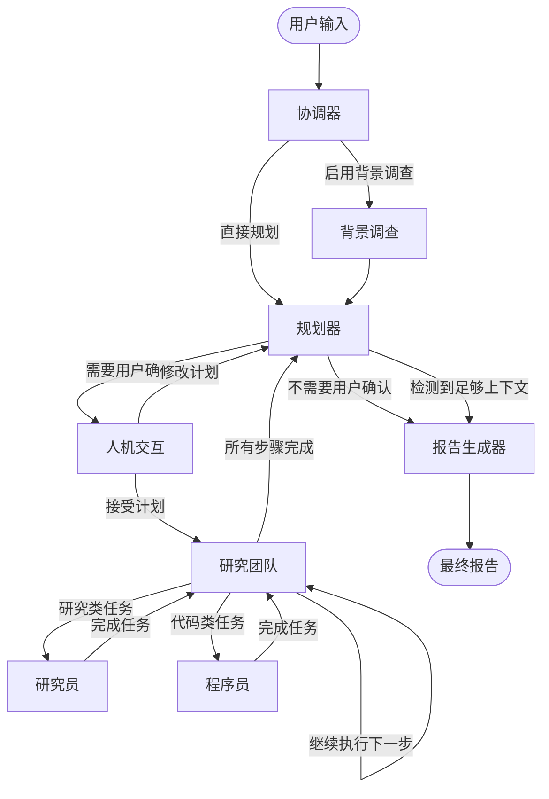
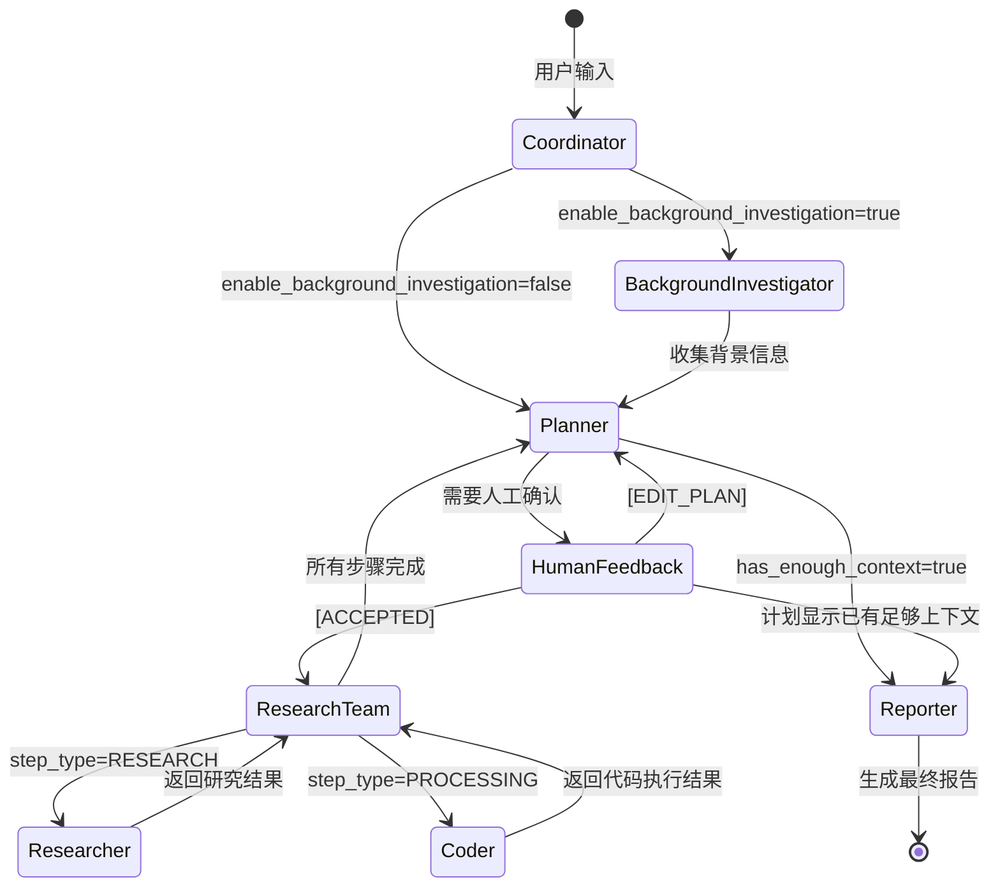
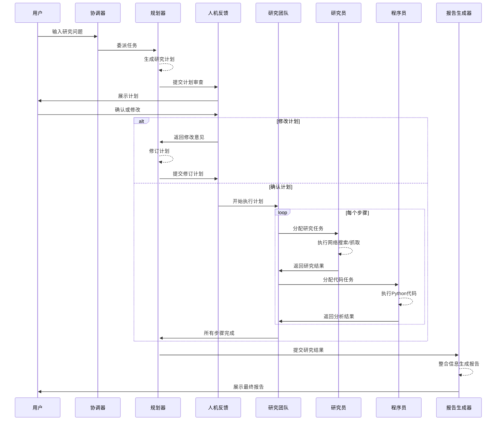
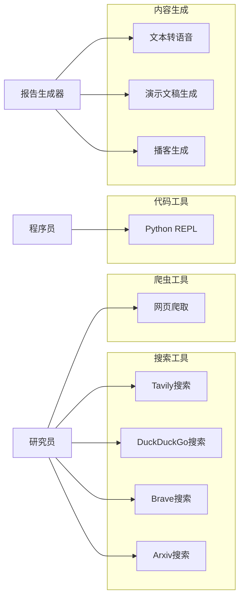

# DeerFlow工作流程图

## 基本工作流程

```mermaid
graph TB
    Start([用户输入]) --> Coordinator[协调器]
    Coordinator -->|启用背景调查| BackgroundInv[背景调查]
    Coordinator -->|直接规划| Planner[规划器]
    BackgroundInv --> Planner
    Planner -->|不需要用户确认| Reporter[报告生成器]
    Planner -->|需要用户确认| HumanFeedback[人机交互]
    HumanFeedback -->|接受计划| ResearchTeam[研究团队]
    HumanFeedback -->|修改计划| Planner
    ResearchTeam -->|研究类任务| Researcher[研究员]
    ResearchTeam -->|代码类任务| Coder[程序员]
    Researcher -->|完成任务| ResearchTeam
    Coder -->|完成任务| ResearchTeam
    ResearchTeam -->|所有步骤完成| Planner
    ResearchTeam -->|继续执行下一步| ResearchTeam
    Planner -->|检测到足够上下文| Reporter
    Reporter --> End([最终报告])
```

## 详细状态转换

```mermaid
stateDiagram-v2
    [*] --> Coordinator: 用户输入
    Coordinator --> BackgroundInvestigator: enable_background_investigation=true
    Coordinator --> Planner: enable_background_investigation=false
    BackgroundInvestigator --> Planner: 收集背景信息
    
    Planner --> HumanFeedback: 需要人工确认
    Planner --> Reporter: has_enough_context=true
    
    HumanFeedback --> Planner: [EDIT_PLAN]
    HumanFeedback --> ResearchTeam: [ACCEPTED]
    HumanFeedback --> Reporter: 计划显示已有足够上下文
    
    ResearchTeam --> Researcher: step_type=RESEARCH
    ResearchTeam --> Coder: step_type=PROCESSING
    ResearchTeam --> Planner: 所有步骤完成
    
    Researcher --> ResearchTeam: 返回研究结果
    Coder --> ResearchTeam: 返回代码执行结果
    
    Reporter --> [*]: 生成最终报告
```

## 单次研究步骤流程

```mermaid
sequenceDiagram
    participant U as 用户
    participant C as 协调器
    participant P as 规划器
    participant HF as 人机反馈
    participant RT as 研究团队
    participant R as 研究员
    participant CD as 程序员
    participant RP as 报告生成器
    
    U->>C: 输入研究问题
    C->>+P: 委派任务
    P-->>P: 生成研究计划
    P->>HF: 提交计划审查
    HF->>U: 展示计划
    U->>HF: 确认或修改
    
    alt 修改计划
        HF->>P: 返回修改意见
        P-->>P: 修订计划
        P->>HF: 提交修订计划
    else 确认计划
        HF->>RT: 开始执行计划
        loop 每个步骤
            RT->>R: 分配研究任务
            R-->>R: 执行网络搜索/抓取
            R->>RT: 返回研究结果
            
            RT->>CD: 分配代码任务
            CD-->>CD: 执行Python代码
            CD->>RT: 返回分析结果
        end
        RT->>P: 所有步骤完成
    end
    
    P->>RP: 提交研究结果
    RP-->>RP: 整合信息生成报告
    RP->>U: 展示最终报告
```

## 工具集成流程

```mermaid
graph LR
    subgraph 搜索工具
        TS[Tavily搜索]
        DS[DuckDuckGo搜索]
        BS[Brave搜索]
        AS[Arxiv搜索]
    end
    
    subgraph 爬虫工具
        CT[网页爬取]
    end
    
    subgraph 代码工具
        PT[Python REPL]
    end
    
    subgraph 内容生成
        TTS[文本转语音]
        PPT[演示文稿生成]
        POD[播客生成]
    end
    
    R[研究员] --> TS & DS & BS & AS
    R --> CT
    CD[程序员] --> PT
    RP[报告生成器] --> TTS & PPT & POD
```

以上流程图展示了DeerFlow系统的工作流程、状态转换、交互序列以及工具集成方式，帮助开发者和用户更好地理解系统的运行机制。 