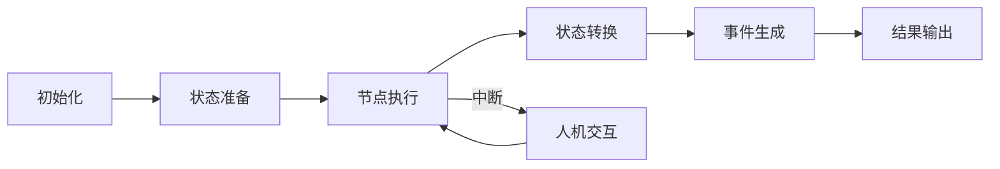

# LangGraph 工作流开发范式

## 1. 概述

LangGraph是一个强大的工作流框架，专门用于构建基于LLM的多智能体系统。本文档总结了使用LangGraph开发工作流的最佳实践和范式。

## 2. 核心概念

### 2.1 基本组件

1. **State（状态）**
   - 工作流的核心数据结构
   - 包含所有节点共享的上下文信息
   - 支持持久化和恢复

2. **Node（节点）**
   - 工作流中的处理单元
   - 接收状态，执行逻辑，返回命令
   - 可以是LLM调用、工具使用或人机交互

3. **Command（命令）**
   - 节点间通信的标准格式
   - 控制工作流程的流转
   - 支持状态更新和中断处理

4. **Graph（图）**
   - 定义节点之间的连接关系
   - 管理状态流转
   - 处理事件流

### 2.2 工作流生命周期



## 3. 开发范式

### 3.1 项目结构

```
project/
├── graph/
│   ├── __init__.py
│   ├── builder.py      # 图构建器
│   ├── config.py       # 配置定义
│   └── nodes/
│       ├── __init__.py
│       ├── base.py     # 基础节点类
│       └── specific/   # 具体节点实现
├── server/
│   ├── __init__.py
│   └── app.py         # API服务
└── utils/
    └── helpers.py     # 工具函数
```

### 3.2 状态管理范式

```python
# 状态定义示例
class State(TypedDict):
    messages: List[Message]           # 消息历史
    current_node: str                 # 当前节点
    context: Dict[str, Any]          # 上下文数据
    temp_data: Optional[Dict]        # 临时数据
    
# 状态更新范式
def update_state(state: State, updates: Dict) -> State:
    return {
        **state,
        **updates,
        "context": {
            **state.get("context", {}),
            **updates.get("context", {})
        }
    }
```

### 3.3 节点实现范式

```python
# 基础节点类
class BaseNode:
    def __init__(self, config: Dict[str, Any]):
        self.config = config
        
    async def process(self, state: State) -> Command:
        raise NotImplementedError
        
    def _prepare_messages(self, state: State) -> List[Message]:
        # 准备LLM输入消息
        pass
        
    def _handle_response(self, response: Any) -> Command:
        # 处理LLM响应
        pass

# 具体节点实现示例
class AnalyzerNode(BaseNode):
    async def process(self, state: State) -> Command:
        # 1. 准备输入
        messages = self._prepare_messages(state)
        
        # 2. 调用LLM
        response = await self.llm.ainvoke(messages)
        
        # 3. 处理响应
        command = self._handle_response(response)
        
        # 4. 返回命令
        return command
```

### 3.4 图构建范式

```python
# 图构建器示例
class GraphBuilder:
    def __init__(self):
        self.nodes = {}
        self.edges = []
        
    def add_node(self, name: str, node: BaseNode) -> 'GraphBuilder':
        self.nodes[name] = node
        return self
        
    def add_edge(self, from_node: str, to_node: str, condition: Optional[Callable] = None):
        self.edges.append((from_node, to_node, condition))
        return self
        
    def build(self) -> Graph:
        # 构建并返回图实例
        pass

# 使用示例
graph = (GraphBuilder()
    .add_node("coordinator", CoordinatorNode(config))
    .add_node("planner", PlannerNode(config))
    .add_node("executor", ExecutorNode(config))
    .add_edge("coordinator", "planner")
    .add_edge("planner", "executor")
    .build())
```

### 3.5 事件处理范式

```python
# 事件类型定义
class EventType(str, Enum):
    MESSAGE = "message"
    TOOL_CALL = "tool_call"
    INTERRUPT = "interrupt"
    ERROR = "error"

# 事件生成器
def event_generator(event_type: EventType, data: Dict) -> Dict:
    return {
        "type": event_type,
        "timestamp": datetime.now().isoformat(),
        "data": data
    }

# 事件处理示例
async def handle_event(event: Dict) -> None:
    event_type = EventType(event["type"])
    
    if event_type == EventType.INTERRUPT:
        # 处理中断事件
        await handle_interrupt(event["data"])
    elif event_type == EventType.TOOL_CALL:
        # 处理工具调用
        await handle_tool_call(event["data"])
```

## 4. 最佳实践

### 4.1 状态管理

1. **状态不可变性**
   - 使用不可变数据结构
   - 通过update_state函数更新状态
   - 避免直接修改状态对象

2. **状态持久化**
   - 实现状态序列化和反序列化
   - 支持断点续传
   - 处理状态恢复边缘情况

### 4.2 错误处理

```python
# 错误处理范式
class WorkflowError(Exception):
    def __init__(self, message: str, node: str, state: State):
        self.message = message
        self.node = node
        self.state = state

async def safe_node_execution(node: BaseNode, state: State) -> Command:
    try:
        return await node.process(state)
    except Exception as e:
        raise WorkflowError(str(e), node.__class__.__name__, state)
```

### 4.3 测试策略

1. **单元测试**
   - 测试各个节点的独立功能
   - 模拟LLM响应
   - 验证状态转换

2. **集成测试**
   - 测试完整工作流
   - 验证节点间交互
   - 测试中断处理

3. **模拟测试**
   ```python
   # 测试用例示例
   async def test_workflow():
       # 准备测试数据
       initial_state = State(...)
       
       # 创建测试图
       test_graph = create_test_graph()
       
       # 执行工作流
       async for event in test_graph.astream(initial_state):
           # 验证事件
           assert_event_valid(event)
   ```

### 4.4 性能优化

1. **并行处理**
   - 识别可并行执行的节点
   - 使用异步操作
   - 实现任务队列

2. **缓存策略**
   - 缓存LLM响应
   - 实现状态快照
   - 优化重复操作

### 4.5 扩展性设计

1. **插件系统**
   ```python
   # 插件接口
   class Plugin(Protocol):
       async def initialize(self, config: Dict) -> None: ...
       async def process(self, state: State) -> State: ...
       async def cleanup(self) -> None: ...
   
   # 插件管理器
   class PluginManager:
       def __init__(self):
           self.plugins: Dict[str, Plugin] = {}
           
       def register(self, name: str, plugin: Plugin):
           self.plugins[name] = plugin
           
       async def execute_plugin(self, name: str, state: State) -> State:
           return await self.plugins[name].process(state)
   ```

2. **工具集成**
   - 标准化工具接口
   - 支持动态工具注册
   - 实现工具版本管理

## 5. 调试与监控

### 5.1 日志系统

```python
# 日志装饰器
def log_node_execution(func):
    async def wrapper(self, state: State) -> Command:
        logger.info(f"Executing node: {self.__class__.__name__}")
        logger.debug(f"Input state: {state}")
        
        result = await func(self, state)
        
        logger.debug(f"Output command: {result}")
        return result
    return wrapper
```

### 5.2 监控指标

1. **性能指标**
   - 节点执行时间
   - LLM调用延迟
   - 状态大小监控

2. **质量指标**
   - 完成率统计
   - 错误率跟踪
   - 用户满意度

### 5.3 可视化工具

1. **状态流转图**
   - 可视化工作流程
   - 显示当前状态
   - 标记关键路径

2. **性能面板**
   - 实时监控指标
   - 历史数据分析
   - 异常检测

## 6. 安全考虑

### 6.1 数据安全

1. **敏感数据处理**
   - 实现数据脱敏
   - 加密存储
   - 访问控制

2. **审计日志**
   - 记录关键操作
   - 保存操作历史
   - 支持回溯分析

### 6.2 系统安全

1. **输入验证**
   ```python
   # 输入验证装饰器
   def validate_input(schema: Dict):
       def decorator(func):
           async def wrapper(self, state: State) -> Command:
               # 验证输入状态
               jsonschema.validate(state, schema)
               return await func(self, state)
           return wrapper
       return decorator
   ```

2. **资源限制**
   - 实现超时机制
   - 控制资源使用
   - 防止无限循环

## 7. 部署与维护

### 7.1 部署策略

1. **容器化**
   - 使用Docker封装
   - 环境一致性
   - 简化部署

2. **扩展性**
   - 水平扩展支持
   - 负载均衡
   - 服务发现

### 7.2 维护计划

1. **更新策略**
   - 版本管理
   - 平滑升级
   - 回滚机制

2. **监控告警**
   - 健康检查
   - 异常告警
   - 性能监控

## 8. 示例实现

### 8.1 简单工作流示例

```python
# 1. 定义节点
class AnalysisNode(BaseNode):
    async def process(self, state: State) -> Command:
        response = await self.llm.analyze(state["input"])
        return Command(goto="planning", updates={"analysis": response})

class PlanningNode(BaseNode):
    async def process(self, state: State) -> Command:
        plan = await self.llm.create_plan(state["analysis"])
        return Command(goto="execution", updates={"plan": plan})

class ExecutionNode(BaseNode):
    async def process(self, state: State) -> Command:
        result = await self.execute_plan(state["plan"])
        return Command(goto="end", updates={"result": result})

# 2. 构建工作流
workflow = (GraphBuilder()
    .add_node("start", AnalysisNode(config))
    .add_node("planning", PlanningNode(config))
    .add_node("execution", ExecutionNode(config))
    .add_edge("start", "planning")
    .add_edge("planning", "execution")
    .build())

# 3. 运行工作流
async def run_workflow(input_data: Dict):
    initial_state = State(input=input_data)
    
    async for event in workflow.astream(initial_state):
        yield event
```

### 8.2 高级特性示例

```python
# 1. 中断处理
class InterruptibleNode(BaseNode):
    async def process(self, state: State) -> Command:
        if needs_human_input(state):
            return Command(
                interrupt=True,
                message="需要人工确认",
                options=["确认", "修改", "取消"]
            )
        return await self.normal_process(state)

# 2. 并行处理
class ParallelNode(BaseNode):
    async def process(self, state: State) -> Command:
        tasks = [
            self.process_subtask(task, state)
            for task in state["tasks"]
        ]
        results = await asyncio.gather(*tasks)
        return Command(goto="next", updates={"results": results})

# 3. 条件跳转
class ConditionalNode(BaseNode):
    async def process(self, state: State) -> Command:
        condition = await self.evaluate_condition(state)
        return Command(
            goto="path_a" if condition else "path_b",
            updates={"condition_result": condition}
        )
```

## 9. 常见问题与解决方案

### 9.1 状态管理问题

1. **状态过大**
   - 实现状态压缩
   - 清理临时数据
   - 使用外部存储

2. **状态一致性**
   - 实现事务机制
   - 状态验证
   - 回滚支持

### 9.2 性能问题

1. **响应延迟**
   - 优化LLM调用
   - 实现缓存
   - 异步处理

2. **资源消耗**
   - 实现资源池
   - 限制并发
   - 优化算法

### 9.3 扩展性问题

1. **新功能集成**
   - 插件系统
   - 热插拔支持
   - 版本兼容

2. **定制化需求**
   - 配置系统
   - 模板机制
   - 钩子函数

## 10. 参考资源

1. **文档**
   - LangGraph官方文档
   - 最佳实践指南
   - API参考

2. **示例代码**
   - 基础示例
   - 进阶用例
   - 完整项目

3. **工具**
   - 开发工具
   - 调试工具
   - 监控工具 