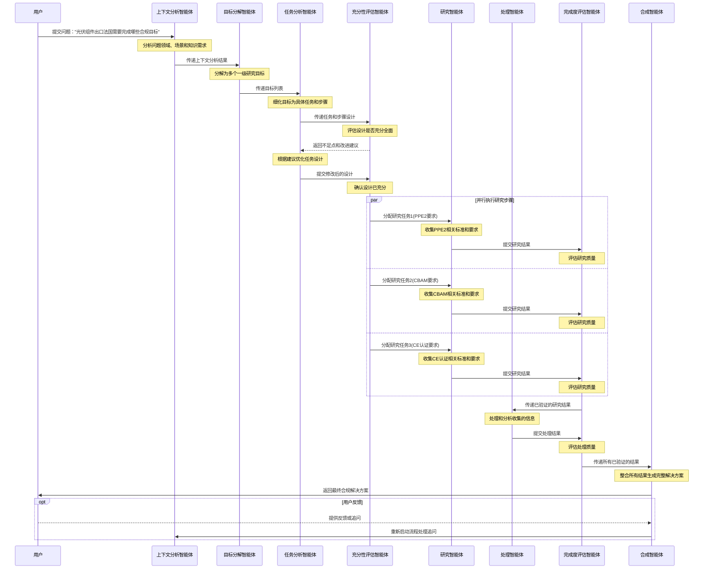

多智能体应用场景

以下是一个多智能体协作解决问题的完整流程，展示了各智能体如何协同工作处理"光伏组件出口法国的合规要求"问题：

在这个流程中：
1. 上下文分析智能体首先分析问题领域（光伏行业）和场景（国际贸易合规）
2. 目标分解智能体将问题分解为多个合规目标（如PPE2合规、CBAM合规、CE认证等）
3. 任务分析智能体为每个目标设计具体任务和步骤
4. 充分性评估智能体验证设计是否全面，提出改进建议
5. 研究智能体并行收集各项合规要求的最新信息
6. 处理智能体分析收集的信息，提取关键要点
7. 完成度评估智能体确保每个步骤的质量
8. 合成智能体整合所有结果，生成完整的合规解决方案

这种多智能体协作模式使系统能够全面、高效地处理复杂问题，同时确保结果的质量和可靠性。