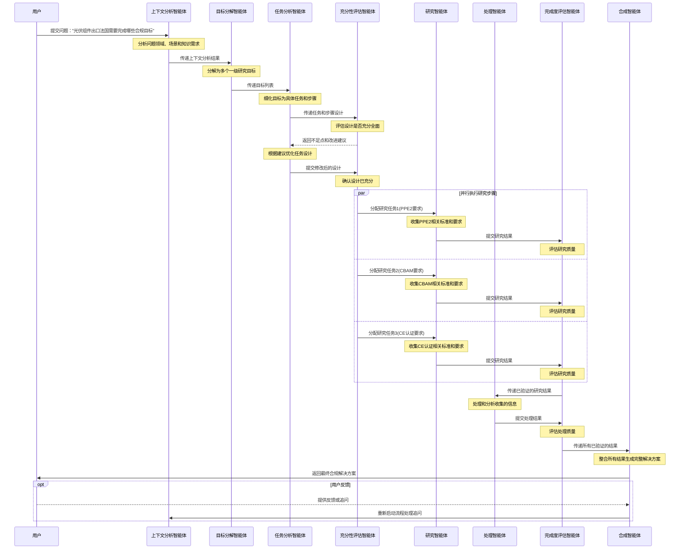

# 多智能体设计文档


## 1. 系统概述

本系统是基于DeerFlow框架的扩展应用，旨在实现一个能够管理和调度复杂研究目标的AI辅助系统。当用户提交研究问题（如"光伏组件出口法国需要完成哪些合规目标"）时，系统将自动分解为目标和任务，并通过调度机制保证各个目标和任务能够被正确、完整地执行。

## 2. 系统架构

系统采用多智能体(Multi-Agent)架构设计，基于LangGraph状态驱动的工作流框架，由以下几个主要部分组成：

### 2.1 核心组件

1. **任务管理服务（Task Management Service）**
   - 负责任务的创建、分解、调度和状态管理
   - 提供任务的持久化存储和状态跟踪
   - 实现任务超时检测和重试机制

2. **LangGraph工作流引擎**
   - 基于LangGraph框架构建状态驱动的多智能体工作流
   - 实现智能体节点间的状态流转和协同工作
   - 管理工作流生命周期和中断处理
   - 支持人机交互和动态调整

3. **多智能体系统（Multi-Agent System）**
   - 上下文分析智能体：分析研究问题的领域特点和上下文需求
   - 目标分解智能体：将复杂问题分解为结构化的研究目标
   - 任务分析智能体：将研究目标进一步分解为具体任务和步骤
   - 研究智能体：收集和分析相关信息
   - 评估智能体：评估任务/步骤的充分性和完成质量

4. **数据库服务（Database Service）**
   - 存储任务、目标和步骤信息
   - 记录执行状态和结果
   - 支持任务恢复和历史查询

5. **Dify API集成服务**
   - 封装与Dify API的交互
   - 处理知识库检索和相关内容获取

6. **爬虫服务（Web Crawler Service）**
   - 按需获取补充信息
   - 支持特定领域的数据爬取

### 2.2 架构图


```
+-------------------+     +---------------------+     +-------------------+
|                   |     |                     |     |                   |
|    客户端/用户    +---->+  DeerFlow Web API   +---->+  任务管理服务    |
|                   |     |                     |     |                   |
+-------------------+     +---------------------+     +--------+----------+
                                                              |
                                                              v
+-------------------+     +---------------------+     +-------------------+
|                   |     |                     |     |                   |
|   爬虫服务        |<----+  LangGraph工作流    |<----+   数据库服务     |
|                   |     |    引擎             |     |                   |
+--------+----------+     +----------+----------+     +-------------------+
         ^                           |
         |                           v
         |                +----------+----------+
         |                |                     |
         +--------------->+  多智能体系统       |
                          |                     |
                          +----------+----------+
                                     |
                                     v
                          +---------+---------+
                          |                   |
                          |   Dify API服务    |
                          |                   |
                          +-------------------+
```

### 2.3 多智能体协作模式

系统采用基于LangGraph的状态驱动多智能体协作模式，主要特点包括：

1. **状态共享机制**
   - 所有智能体共享统一的State对象
   - 每个智能体完成处理后更新State
   - State包含所有上下文信息，确保连贯性

2. **智能体职责划分**
   - 每个智能体专注于特定职责
   - 职责边界清晰，避免功能重叠
   - 根据输入状态动态选择合适的智能体

3. **状态流转控制**
   - 使用LangGraph的Command控制工作流流转
   - 支持条件分支和动态路径选择
   - 处理中断和异常情况

4. **可观察性和可调试性**
   - 全流程状态变化可跟踪
   - 智能体决策过程透明化
   - 提供中间结果查看机制

## 3. 数据模型设计

### 3.1 MySQL数据库模型

1. **Objective（目标）表**
   ```sql
   CREATE TABLE objectives (
       objective_id UUID PRIMARY KEY,
       title TEXT NOT NULL,
       description TEXT,
       status TEXT NOT NULL, -- CREATED, IN_PROGRESS, COMPLETED, FAILED
       created_at TIMESTAMP NOT NULL,
       updated_at TIMESTAMP NOT NULL,
       completed_at TIMESTAMP,
       retry_count INTEGER DEFAULT 0,
       max_retries INTEGER DEFAULT 3
   );
   ```

2. **Task（任务）表**
   ```sql
   CREATE TABLE tasks (
       task_id UUID PRIMARY KEY,
       objective_id UUID REFERENCES objectives(objective_id),
       title TEXT NOT NULL,
       description TEXT,
       status TEXT NOT NULL, -- PENDING, IN_PROGRESS, COMPLETED, FAILED
       priority INTEGER DEFAULT 0,
       created_at TIMESTAMP NOT NULL,
       updated_at TIMESTAMP NOT NULL,
       completed_at TIMESTAMP,
       is_sufficient BOOLEAN DEFAULT FALSE,
       evaluation_criteria TEXT,
       retry_count INTEGER DEFAULT 0,
       max_retries INTEGER DEFAULT 3
   );
   ```

3. **Step（步骤）表**
   ```sql
   CREATE TABLE steps (
       step_id UUID PRIMARY KEY,
       task_id UUID REFERENCES tasks(task_id),
       title TEXT NOT NULL,
       description TEXT,
       status TEXT NOT NULL, -- PENDING, IN_PROGRESS, COMPLETED, FAILED
       priority INTEGER DEFAULT 0,
       created_at TIMESTAMP NOT NULL,
       updated_at TIMESTAMP NOT NULL,
       completed_at TIMESTAMP,
       is_sufficient BOOLEAN DEFAULT FALSE,
       evaluation_criteria TEXT,
       retry_count INTEGER DEFAULT 0,
       max_retries INTEGER DEFAULT 3,
       timeout_seconds INTEGER DEFAULT 300
   );
   ```

4. **Content（内容）表**
   ```sql
   CREATE TABLE contents (
       content_id UUID PRIMARY KEY,
       reference_id UUID NOT NULL, -- 关联到task_id或step_id
       reference_type TEXT NOT NULL, -- 'TASK'或'STEP'
       content_type TEXT NOT NULL, -- 'DIFY_KNOWLEDGE', 'CRAWLED_DATA', 'AGENT_RESULT'
       content TEXT,
       metadata JSONB,
       created_at TIMESTAMP NOT NULL
   );
   ```

5. **Schedule（调度）表**
   ```sql
   CREATE TABLE schedules (
       schedule_id UUID PRIMARY KEY,
       reference_id UUID NOT NULL, -- 关联到objective_id, task_id或step_id
       reference_type TEXT NOT NULL, -- 'OBJECTIVE', 'TASK'或'STEP'
       status TEXT NOT NULL, -- SCHEDULED, RUNNING, COMPLETED, FAILED
       scheduled_at TIMESTAMP NOT NULL,
       started_at TIMESTAMP,
       completed_at TIMESTAMP,
       retry_count INTEGER DEFAULT 0,
       error_message TEXT
   );
   ```

6. **BusinessAnalysis（业务分析）表**
   ```sql
   CREATE TABLE business_analyses (
       analysis_id UUID PRIMARY KEY,
       objective_id UUID REFERENCES objectives(objective_id),
       industry_type TEXT NOT NULL,  -- 行业类型，如"光伏"、"医疗"等
       business_scenario TEXT NOT NULL,  -- 业务场景，如"国际贸易"、"产品认证"等
       key_business_drivers TEXT[],  -- 关键业务驱动因素
       business_constraints TEXT[],  -- 业务约束条件
       analysis_result TEXT,  -- 业务分析结果
       relevant_regulations TEXT[],  -- 相关法规列表
       market_requirements TEXT[],  -- 市场要求
       stakeholders TEXT[],  -- 利益相关方
       business_risks TEXT[],  -- 业务风险
       created_at TIMESTAMP NOT NULL,
       updated_at TIMESTAMP NOT NULL
   );
   ```

7. **IndustryStandard（行业标准）表**
   ```sql
   CREATE TABLE industry_standards (
       standard_id UUID PRIMARY KEY,
       industry_type TEXT NOT NULL,
       standard_name TEXT NOT NULL,
       standard_code TEXT,
       description TEXT,
       issuing_authority TEXT,
       effective_date DATE,
       expiration_date DATE,
       regions TEXT[],  -- 适用区域
       categories TEXT[],  -- 标准类别
       metadata JSONB,
       created_at TIMESTAMP NOT NULL,
       updated_at TIMESTAMP NOT NULL
   );
   ```

### 3.2 对象模型设计

```python
# 目标状态枚举
class ObjectiveStatus(str, Enum):
    CREATED = "CREATED"
    IN_PROGRESS = "IN_PROGRESS"
    COMPLETED = "COMPLETED"
    FAILED = "FAILED"

# 任务/步骤状态枚举
class WorkStatus(str, Enum):
    PENDING = "PENDING"
    IN_PROGRESS = "IN_PROGRESS"
    COMPLETED = "COMPLETED"
    FAILED = "FAILED"

# 内容类型枚举
class ContentType(str, Enum):
    DIFY_KNOWLEDGE = "DIFY_KNOWLEDGE"
    CRAWLED_DATA = "CRAWLED_DATA"
    AGENT_RESULT = "AGENT_RESULT"

# 步骤类型枚举
class StepType(str, Enum):
    RESEARCH = "RESEARCH"  # 需要搜索、收集数据的研究型步骤
    PROCESSING = "PROCESSING"  # 处理已有数据的计算型步骤

# 目标模型
class Objective(BaseModel):
    objective_id: UUID
    title: str
    description: Optional[str] = None
    status: ObjectiveStatus
    created_at: datetime
    updated_at: datetime
    completed_at: Optional[datetime] = None
    retry_count: int = 0
    max_retries: int = 3
    locale: str = "zh-CN"  # 用户语言区域
    
# 任务模型
class Task(BaseModel):
    task_id: UUID
    objective_id: UUID
    title: str
    description: Optional[str] = None
    status: WorkStatus
    priority: int = 0
    created_at: datetime
    updated_at: datetime
    completed_at: Optional[datetime] = None
    is_sufficient: bool = False
    evaluation_criteria: Optional[str] = None
    retry_count: int = 0
    max_retries: int = 3
    analysis_framework: Optional[str] = None  # 分析框架，描述任务解析的方法论

# 步骤模型
class Step(BaseModel):
    step_id: UUID
    task_id: UUID
    title: str
    description: Optional[str] = None
    status: WorkStatus
    priority: int = 0
    created_at: datetime
    updated_at: datetime
    completed_at: Optional[datetime] = None
    is_sufficient: bool = False
    evaluation_criteria: Optional[str] = None
    retry_count: int = 0
    max_retries: int = 3
    timeout_seconds: int = 300
    step_type: StepType = StepType.RESEARCH  # 步骤类型：研究型或处理型
    need_web_search: bool = True  # 是否需要网络搜索获取额外数据
    execution_result: Optional[str] = None  # 步骤执行结果
```

## 4. 多智能体系统设计

### 4.1 智能体类型与职责

系统中的智能体按照职责和处理阶段划分为以下几类：

1. **分析型智能体**
   - **上下文分析智能体**：分析用户查询的领域特点和需求
   - **目标分解智能体**：将主问题分解为结构化的研究目标
   - **任务分析智能体**：将研究目标细化为具体任务和步骤

2. **执行型智能体**
   - **研究智能体**：负责信息收集和外部资源获取
   - **处理智能体**：处理已收集信息，执行计算和分析
   - **合成智能体**：整合多个步骤结果，生成综合输出

3. **评估型智能体**
   - **充分性评估智能体**：评估内容是否足够全面和详细
   - **质量评估智能体**：评估执行结果的质量和准确度
   - **整体评估智能体**：评估最终结果是否满足用户需求

4. **协调型智能体**
   - **调度智能体**：控制工作流执行顺序和资源分配
   - **错误处理智能体**：处理异常情况和错误恢复
   - **人机交互智能体**：管理人类用户的反馈和干预

### 4.2 智能体架构设计

系统中的智能体按照职责和处理阶段划分为以下几类：

1. **分析型智能体**
   - **上下文分析智能体**：分析用户查询的领域特点和需求
   - **目标分解智能体**：将主问题分解为结构化的研究目标
   - **任务分析智能体**：将研究目标细化为具体任务和步骤

2. **执行型智能体**
   - **研究智能体**：负责信息收集和外部资源获取
   - **处理智能体**：处理已收集信息，执行计算和分析
   - **合成智能体**：整合多个步骤结果，生成综合输出

3. **评估型智能体**
   - **充分性评估智能体**：评估内容是否足够全面和详细
   - **质量评估智能体**：评估执行结果的质量和准确度
   - **整体评估智能体**：评估最终结果是否满足用户需求

4. **协调型智能体**
   - **调度智能体**：控制工作流执行顺序和资源分配
   - **错误处理智能体**：处理异常情况和错误恢复
   - **人机交互智能体**：管理人类用户的反馈和干预

### 4.3 智能体间信息流转

各智能体之间通过以下机制实现信息共享和协同：

1. **状态共享模型**

   所有智能体共享统一的工作流状态对象，每个智能体都可以：
   - 读取所有状态信息
   - 更新与自己职责相关的状态部分
   - 通过状态传递处理结果给下一个智能体

   ```python
   # 状态共享示例
   class SharedStateManager:
       """管理智能体间共享的状态"""
       
       def __init__(self, initial_state: Dict = None):
           self.state = initial_state or {}
           self.state_lock = threading.RLock()  # 防止并发写入冲突
           
       def get_state(self) -> Dict:
           """获取当前状态的完整副本"""
           with self.state_lock:
               return copy.deepcopy(self.state)
           
       def update_state(self, agent_id: str, updates: Dict) -> Dict:
           """更新状态并返回更新后的完整状态"""
           with self.state_lock:
               # 记录更新来源
               updates["_metadata"] = {
                   "agent": agent_id,
                   "timestamp": datetime.now().isoformat()
               }
               
               # 合并状态更新
               new_state = update_state(self.state, updates)
               self.state = new_state
               
               return copy.deepcopy(self.state)
   ```

2. **事件驱动通信**

   智能体通过事件机制进行异步通信：
   - 智能体可以发布事件到事件总线
   - 其他智能体可以订阅特定类型的事件
   - 事件带有上下文信息，支持复杂协作模式

   ```python
   # 事件驱动通信示例
   class EventBus:
       """事件总线，用于智能体间异步通信"""
       
       def __init__(self):
           self.subscribers = defaultdict(list)
           
       def subscribe(self, event_type: str, callback: Callable):
           """订阅特定类型的事件"""
           self.subscribers[event_type].append(callback)
           
       def publish(self, event_type: str, data: Dict = None):
           """发布事件"""
           if event_type not in self.subscribers:
               return
               
           event_data = {
               "type": event_type,
               "timestamp": datetime.now().isoformat(),
               "data": data or {}
           }
           
           # 通知所有订阅者
           for callback in self.subscribers[event_type]:
               try:
                   asyncio.create_task(callback(event_data))
               except Exception as e:
                   logger.error(f"Error notifying subscriber: {str(e)}")
   ```

3. **工作流调度**

   LangGraph工作流引擎负责智能体的调度和执行：
   - 根据状态和条件决定下一个执行的智能体
   - 管理智能体之间的依赖关系
   - 处理并行执行和同步点

   ```python
   # 工作流调度示例
   class AgentWorkflowController:
       """控制多智能体工作流的执行"""
       
       def __init__(self, workflow_graph, state_manager):
           self.workflow = workflow_graph
           self.state_manager = state_manager
           
       async def execute_workflow(self, initial_state: Dict = None):
           """执行完整工作流"""
           state = initial_state or {}
           
           # 使用LangGraph的astream API流式执行工作流
           async for event in self.workflow.astream(state):
               # 处理工作流事件
               if event.get("type") == "agent_start":
                   agent_id = event.get("agent_id")
                   logger.info(f"Agent {agent_id} started")
                   
               elif event.get("type") == "agent_end":
                   agent_id = event.get("agent_id")
                   result = event.get("output")
                   
                   # 更新共享状态
                   self.state_manager.update_state(agent_id, result)
                   logger.info(f"Agent {agent_id} completed")
                   
               elif event.get("type") == "interrupt":
                   # 处理需要人工干预的中断
                   await self._handle_interrupt(event)
   ```

### 4.4 协作模式与特性

多智能体系统支持以下协作模式和特性：

1. **分治协作模式**
   - 将复杂问题分解为子问题分配给不同智能体
   - 各智能体独立解决子问题
   - 最终合并结果形成完整解决方案

   ```mermaid
   graph TD
       A[主问题] --> B[上下文分析智能体]
       B --> C[目标分解智能体]
       C --> D[子目标1]
       C --> E[子目标2]
       C --> F[子目标3]
       D --> G[任务分析智能体1]
       E --> H[任务分析智能体2]
       F --> I[任务分析智能体3]
       G --> J[执行智能体组1]
       H --> K[执行智能体组2]
       I --> L[执行智能体组3]
       J --> M[合成智能体]
       K --> M
       L --> M
       M --> N[最终结果]
   ```

2. **专家委员会模式**
   - 多个智能体从不同角度分析同一问题
   - 提供各自的分析结果和建议
   - 通过投票或合并机制整合各方观点

   ```python
   # 专家委员会示例
   class ExpertCommittee:
       """多智能体专家委员会，共同解决问题"""
       
       def __init__(self, experts: List[BaseAgent], aggregator: BaseAggregator):
           self.experts = experts
           self.aggregator = aggregator
           
       async def analyze(self, problem: Dict) -> Dict:
           """使用多个专家智能体分析问题"""
           # 收集所有专家的意见
           expert_opinions = []
           
           for expert in self.experts:
               opinion = await expert.analyze(problem)
               expert_opinions.append(opinion)
               
           # 整合所有专家意见
           aggregated_result = await self.aggregator.aggregate(expert_opinions)
           
           return aggregated_result
   ```

3. **迭代改进模式**
   - 一个智能体初步解决问题
   - 其他智能体评估并提出改进建议
   - 循环迭代直到达到质量标准

   ```python
   # 迭代改进示例
   class IterativeImprovement:
       """使用多个智能体迭代改进解决方案"""
       
       def __init__(self, solver: BaseAgent, evaluator: BaseAgent, max_iterations: int = 3):
           self.solver = solver
           self.evaluator = evaluator
           self.max_iterations = max_iterations
           
       async def solve(self, problem: Dict) -> Dict:
           """迭代解决问题"""
           solution = await self.solver.solve(problem)
           
           for i in range(self.max_iterations):
               # 评估当前解决方案
               evaluation = await self.evaluator.evaluate(solution)
               
               # 检查是否已达到质量标准
               if evaluation.get("quality_score", 0) >= 90:
                   break
                   
               # 改进解决方案
               improvement_suggestions = evaluation.get("improvement_suggestions", [])
               if not improvement_suggestions:
                   break
                   
               # 基于改进建议更新解决方案
               solution = await self.solver.improve(solution, improvement_suggestions)
               
           return solution
   ```

4. **监督与审核模式**
   - 执行智能体完成主要工作
   - 监督智能体审查结果并发现问题
   - 审核智能体验证合规性和质量

   ```python
   # 监督审核示例
   class SupervisedExecution:
       """带监督和审核的智能体执行模式"""
       
       def __init__(self, executor: BaseAgent, supervisor: BaseAgent, auditor: BaseAgent):
           self.executor = executor
           self.supervisor = supervisor
           self.auditor = auditor
           
       async def execute_with_oversight(self, task: Dict) -> Dict:
           """带监督地执行任务"""
           # 执行任务
           result = await self.executor.execute(task)
           
           # 监督检查，发现潜在问题
           supervision_report = await self.supervisor.supervise(result)
           
           if supervision_report.get("has_issues", False):
               # 如果发现问题，执行修正
               corrections = supervision_report.get("corrections", [])
               result = await self.executor.correct(result, corrections)
           
           # 审核最终结果
           audit_report = await self.auditor.audit(result)
           
           return {
               "result": result,
               "supervision_report": supervision_report,
               "audit_report": audit_report
           }
   ```

### 4.5 多智能体应用场景示例

以下是一个多智能体协作解决问题的完整流程示例，展示了各智能体如何协同工作处理"光伏组件出口法国的合规要求"问题：



在这个流程中：
1. 上下文分析智能体首先分析问题领域（光伏行业）和场景（国际贸易合规）
2. 目标分解智能体将问题分解为多个合规目标（如PPE2合规、CBAM合规、CE认证等）
3. 任务分析智能体为每个目标设计具体任务和步骤
4. 充分性评估智能体验证设计是否全面，提出改进建议
5. 研究智能体并行收集各项合规要求的最新信息
6. 处理智能体分析收集的信息，提取关键要点
7. 完成度评估智能体确保每个步骤的质量
8. 合成智能体整合所有结果，生成完整的合规解决方案

这种多智能体协作模式使系统能够全面、高效地处理复杂问题，同时确保结果的质量和可靠性。

### 4.6 智能体汇总与提示词设计

 见 promot.md

## 5. 工作流引擎设计

### 5.1 扩展DeerFlow框架

系统基于LangGraph框架构建状态驱动的工作流引擎，实现多智能体的协同工作。工作流架构具有以下特点：

1. **状态图设计**
   - 使用LangGraph的`StateGraph`定义状态转换图
   - 每个节点代表一个智能体或处理步骤
   - 通过边和条件定义状态流转路径

```python
from langgraph.graph import StateGraph
from typing import TypedDict, List, Dict, Optional

# 定义工作流状态结构
class WorkflowState(TypedDict):
    # 基础信息
    query: str  # 用户原始查询
    messages: List[Dict]  # 消息历史
    locale: str  # 语言设置
    
    # 目标相关
    objective_id: Optional[str]
    objectives: List[Dict]
    current_objective: Optional[Dict]
    
    # 任务相关
    tasks: List[Dict]
    current_task: Optional[Dict]
    
    # 步骤相关
    steps: List[Dict]
    current_step: Optional[Dict]
    
    # 执行相关
    context_analysis: Optional[Dict]
    execution_results: Dict[str, Dict]
    content_sufficient: Optional[bool]
    
    # 控制流相关
    current_node: str
    next_node: Optional[str]
    error: Optional[Dict]

# 创建状态图
workflow = StateGraph(WorkflowState)

# 添加节点
workflow.add_node("context_analyzer", context_analyzer_node)
workflow.add_node("objective_decomposer", objective_decomposer_node)
workflow.add_node("task_analyzer", task_analyzer_node)
workflow.add_node("sufficiency_evaluator", sufficiency_evaluator_node)
workflow.add_node("research_agent", research_agent_node)
workflow.add_node("processing_agent", processing_agent_node)
workflow.add_node("completion_evaluator", completion_evaluator_node)

# 定义状态转换边
workflow.add_edge("context_analyzer", "objective_decomposer")
workflow.add_edge("objective_decomposer", "task_analyzer")
workflow.add_edge("task_analyzer", "sufficiency_evaluator")

# 使用条件边处理分支逻辑
workflow.add_conditional_edges(
    "sufficiency_evaluator",
    evaluate_sufficiency,
    {
        "sufficient": "objective_complete",
        "insufficient": "research_agent"
    }
)

# 添加执行结果评估的条件边
workflow.add_conditional_edges(
    "completion_evaluator",
    evaluate_completion,
    {
        "complete": "next_step_selector",
        "incomplete": "retry_step"
    }
)

# 编译工作流
workflow.compile()
```

2. **节点类型设计**
   - **分析型节点**：负责分析问题、分解目标和任务、评估结果
   - **执行型节点**：负责执行具体任务步骤、收集信息、处理数据
   - **控制型节点**：负责调度流程、选择下一步、处理异常

3. **状态转换逻辑**
   - 每个节点处理后返回状态更新和下一步指令
   - 通过条件函数控制分支流程
   - 动态调整执行路径应对复杂场景

```python
# 条件函数示例：评估步骤设计是否充分
def evaluate_sufficiency(state: WorkflowState) -> str:
    """评估当前步骤设计是否充分"""
    if state.get("content_sufficient", False):
        return "sufficient"
    else:
        return "insufficient"

# 条件函数示例：评估步骤执行是否完成
def evaluate_completion(state: WorkflowState) -> str:
    """评估步骤执行是否完成标准"""
    current_step_id = state.get("current_step", {}).get("step_id")
    result = state.get("execution_results", {}).get(current_step_id, {})
    
    if result.get("quality_score", 0) >= 80:
        return "complete"
    else:
        return "incomplete"
```

### 5.2 LangGraph工作流设计

系统基于LangGraph框架构建状态驱动的工作流引擎，实现多智能体的协同工作。工作流架构具有以下特点：

1. **状态图设计**
   - 使用LangGraph的`StateGraph`定义状态转换图
   - 每个节点代表一个智能体或处理步骤
   - 通过边和条件定义状态流转路径

```python
from langgraph.graph import StateGraph
from typing import TypedDict, List, Dict, Optional

# 定义工作流状态结构
class WorkflowState(TypedDict):
    # 基础信息
    query: str  # 用户原始查询
    messages: List[Dict]  # 消息历史
    locale: str  # 语言设置
    
    # 目标相关
    objective_id: Optional[str]
    objectives: List[Dict]
    current_objective: Optional[Dict]
    
    # 任务相关
    tasks: List[Dict]
    current_task: Optional[Dict]
    
    # 步骤相关
    steps: List[Dict]
    current_step: Optional[Dict]
    
    # 执行相关
    context_analysis: Optional[Dict]
    execution_results: Dict[str, Dict]
    content_sufficient: Optional[bool]
    
    # 控制流相关
    current_node: str
    next_node: Optional[str]
    error: Optional[Dict]

# 创建状态图
workflow = StateGraph(WorkflowState)

# 添加节点
workflow.add_node("context_analyzer", context_analyzer_node)
workflow.add_node("objective_decomposer", objective_decomposer_node)
workflow.add_node("task_analyzer", task_analyzer_node)
workflow.add_node("sufficiency_evaluator", sufficiency_evaluator_node)
workflow.add_node("research_agent", research_agent_node)
workflow.add_node("processing_agent", processing_agent_node)
workflow.add_node("completion_evaluator", completion_evaluator_node)

# 定义状态转换边
workflow.add_edge("context_analyzer", "objective_decomposer")
workflow.add_edge("objective_decomposer", "task_analyzer")
workflow.add_edge("task_analyzer", "sufficiency_evaluator")

# 使用条件边处理分支逻辑
workflow.add_conditional_edges(
    "sufficiency_evaluator",
    evaluate_sufficiency,
    {
        "sufficient": "objective_complete",
        "insufficient": "research_agent"
    }
)

# 添加执行结果评估的条件边
workflow.add_conditional_edges(
    "completion_evaluator",
    evaluate_completion,
    {
        "complete": "next_step_selector",
        "incomplete": "retry_step"
    }
)

# 编译工作流
workflow.compile()
```

2. **节点类型设计**
   - **分析型节点**：负责分析问题、分解目标和任务、评估结果
   - **执行型节点**：负责执行具体任务步骤、收集信息、处理数据
   - **控制型节点**：负责调度流程、选择下一步、处理异常

3. **状态转换逻辑**
   - 每个节点处理后返回状态更新和下一步指令
   - 通过条件函数控制分支流程
   - 动态调整执行路径应对复杂场景

```python
# 条件函数示例：评估步骤设计是否充分
def evaluate_sufficiency(state: WorkflowState) -> str:
    """评估当前步骤设计是否充分"""
    if state.get("content_sufficient", False):
        return "sufficient"
    else:
        return "insufficient"

# 条件函数示例：评估步骤执行是否完成
def evaluate_completion(state: WorkflowState) -> str:
    """评估步骤执行是否完成标准"""
    current_step_id = state.get("current_step", {}).get("step_id")
    result = state.get("execution_results", {}).get(current_step_id, {})
    
    if result.get("quality_score", 0) >= 80:
        return "complete"
    else:
        return "incomplete"
```

### 5.3 状态管理机制

LangGraph工作流的核心是状态管理，系统采用以下机制管理工作流状态：

1. **状态结构设计**
   - 使用TypedDict定义明确的状态结构
   - 包含所有上下文、处理结果和控制信息
   - 支持嵌套结构和复杂类型

2. **状态更新规则**
   - 状态对象不可变，每次通过构造新状态更新
   - 节点只能修改自己负责的部分
   - 更新采用部分更新模式，保留未修改的状态

```python
def update_state(state: WorkflowState, updates: Dict) -> WorkflowState:
    """更新工作流状态"""
    # 深度合并现有状态和更新
    new_state = {**state}
    
    for key, value in updates.items():
        if isinstance(value, dict) and key in new_state and isinstance(new_state[key], dict):
            # 对于字典类型进行递归合并
            new_state[key] = {**new_state[key], **value}
        else:
            # 对于非字典类型直接替换
            new_state[key] = value
            
    return new_state
```

3. **状态持久化**
   - 支持状态序列化到数据库
   - 允许工作流中断恢复
   - 实现状态历史记录和回溯

```python
async def persist_state(state: WorkflowState, db_service):
    """将工作流状态持久化到数据库"""
    # 序列化状态
    serialized_state = json.dumps(state)
    
    # 获取相关ID
    objective_id = state.get("objective_id")
    if not objective_id:
        return
        
    # 保存到数据库
    await db_service.update_workflow_state(objective_id, serialized_state)

async def restore_state(objective_id: str, db_service) -> WorkflowState:
    """从数据库恢复工作流状态"""
    # 从数据库获取序列化状态
    serialized_state = await db_service.get_workflow_state(objective_id)
    
    # 反序列化并返回
    return json.loads(serialized_state)
```

### 5.4 节点实现

工作流中的每个节点代表一个处理步骤或智能体，具有统一的接口和处理模式：

1. **基础节点接口**

```python
class BaseNode:
    """工作流节点基类"""
    
    def __init__(self, config: Dict):
        """初始化节点"""
        self.config = config
        # 初始化所需资源，如LLM客户端、数据库连接等
    
    async def __call__(self, state: WorkflowState) -> WorkflowState:
        """节点调用入口"""
        try:
            # 前处理：准备输入、校验状态
            self._validate_input(state)
            prepared_input = self._prepare_input(state)
            
            # 核心处理：节点主逻辑
            result = await self._process(prepared_input, state)
            
            # 后处理：更新状态
            new_state = self._update_state(state, result)
            return new_state
            
        except Exception as e:
            # 异常处理
            return self._handle_error(state, e)
    
    def _validate_input(self, state: WorkflowState) -> None:
        """验证输入状态"""
        pass
        
    def _prepare_input(self, state: WorkflowState) -> Dict:
        """准备节点输入"""
        pass
        
    async def _process(self, input_data: Dict, state: WorkflowState) -> Dict:
        """节点核心处理逻辑"""
        raise NotImplementedError
        
    def _update_state(self, state: WorkflowState, result: Dict) -> WorkflowState:
        """根据处理结果更新状态"""
        pass
        
    def _handle_error(self, state: WorkflowState, error: Exception) -> WorkflowState:
        """处理节点异常"""
        return {
            **state,
            "error": {
                "node": self.__class__.__name__,
                "message": str(error),
                "timestamp": datetime.now().isoformat()
            },
            "next_node": "error_handler"
        }
```

2. **智能体节点实现**

以上下文分析智能体为例：

```python
class ContextAnalyzerNode(BaseNode):
    """上下文分析智能体节点"""
    
    async def _process(self, input_data: Dict, state: WorkflowState) -> Dict:
        """分析用户查询的上下文"""
        # 获取用户查询
        query = input_data.get("query")
        locale = input_data.get("locale", "zh-CN")
        
        # 从Dify获取相关知识库内容
        dify_content = await self._get_dify_knowledge(query)
        
        # 准备智能体提示
        prompt = self._prepare_prompt(query, dify_content, locale)
        
        # 调用LLM获取分析结果
        llm_response = await self.llm.invoke(prompt)
        
        # 解析LLM响应
        try:
            context_analysis = json.loads(llm_response)
        except json.JSONDecodeError:
            # 如果JSON解析失败，尝试使用正则提取
            context_analysis = self._extract_json(llm_response)
        
        # 返回处理结果
        return {
            "context_analysis": context_analysis,
            "next_node": "objective_decomposer"
        }
    
    async def _get_dify_knowledge(self, query: str) -> str:
        """从Dify获取相关知识库内容"""
        # 实现Dify API调用
        pass
        
    def _prepare_prompt(self, query: str, dify_content: str, locale: str) -> str:
        """准备LLM提示"""
        # 使用预定义的提示模板
        return context_analyzer_prompt_template.format(
            user_query=query,
            initial_knowledge=dify_content,
            locale=locale
        )
        
    def _extract_json(self, text: str) -> Dict:
        """从文本中提取JSON对象"""
        # 使用正则表达式或其他方法提取JSON
        pass
```

3. **合作与沟通机制**

节点间通过状态共享实现协作，保持处理流程连贯：

```python
class ObjectiveDecomposerNode(BaseNode):
    """目标分解智能体节点"""
    
    async def _process(self, input_data: Dict, state: WorkflowState) -> Dict:
        """将研究问题分解为结构化目标"""
        # 获取上下文分析结果
        context_analysis = input_data.get("context_analysis", {})
        query = input_data.get("query")
        locale = input_data.get("locale", "zh-CN")
        
        # 使用上下文分析结果指导目标分解
        domain = context_analysis.get("domain", "")
        recommended_frameworks = context_analysis.get("recommended_frameworks", [])
        
        # 准备智能体提示
        prompt = self._prepare_prompt(
            query=query,
            context_analysis=context_analysis,
            locale=locale
        )
        
        # 调用LLM获取分解结果
        llm_response = await self.llm.invoke(prompt)
        
        # 解析目标列表
        objectives = self._parse_objectives(llm_response)
        
        # 保存目标到数据库
        objective_ids = await self._save_objectives(objectives, query)
        
        # 返回处理结果
        return {
            "objectives": objectives,
            "objective_id": objective_ids[0] if objective_ids else None,
            "next_node": "task_analyzer"
        }
```

#### 5.5 错误处理和恢复

工作流包含完善的错误处理和恢复机制，确保系统稳定性：

1. **节点级错误处理**
   - 每个节点内部捕获和处理异常
   - 记录详细错误信息到状态
   - 支持节点级重试逻辑

2. **工作流级错误处理**
   - 设置专用错误处理节点
   - 根据错误类型决定恢复策略
   - 支持回退到上一状态

```python
class ErrorHandlerNode(BaseNode):
    """错误处理节点"""
    
    async def _process(self, input_data: Dict, state: WorkflowState) -> Dict:
        """处理工作流错误"""
        # 获取错误信息
        error = state.get("error", {})
        error_node = error.get("node")
        error_message = error.get("message")
        
        # 记录错误
        await self._log_error(error)
        
        # 判断是否可重试
        if self._can_retry(error_node, error_message, state):
            # 增加重试计数
            retry_count = state.get("retry_counts", {}).get(error_node, 0) + 1
            
            return {
                "retry_counts": {**state.get("retry_counts", {}), error_node: retry_count},
                "error": None,  # 清除错误
                "next_node": error_node  # 返回出错节点重试
            }
        else:
            # 无法重试，切换到失败处理
            return {
                "next_node": "failure_handler"
            }
    
    def _can_retry(self, node: str, error_message: str, state: WorkflowState) -> bool:
        """判断是否可以重试"""
        # 检查重试次数是否超限
        retry_count = state.get("retry_counts", {}).get(node, 0)
        max_retries = self.config.get("max_retries", {}).get(node, 3)
        
        if retry_count >= max_retries:
            return False
            
        # 检查错误类型是否可重试
        non_retriable_errors = ["authorization", "invalid_input"]
        for err_type in non_retriable_errors:
            if err_type in error_message.lower():
                return False
                
        return True
```

3. **中断和恢复机制**
   - 支持用户中断和人工干预
   - 保存工作流状态用于恢复
   - 实现断点续传功能

```python
class WorkflowManager:
    """工作流管理器"""
    
    def __init__(self, workflow, db_service):
        self.workflow = workflow
        self.db_service = db_service
        
    async def start_workflow(self, query: str, locale: str = "zh-CN") -> str:
        """启动新工作流"""
        # 创建初始状态
        initial_state = {
            "query": query,
            "messages": [],
            "locale": locale,
            "current_node": "context_analyzer"
        }
        
        # 创建工作流记录并获取ID
        workflow_id = await self._create_workflow_record(query)
        
        # 异步执行工作流
        asyncio.create_task(self._execute_workflow(workflow_id, initial_state))
        
        return workflow_id
        
    async def resume_workflow(self, workflow_id: str, user_input: str = None) -> None:
        """恢复中断的工作流"""
        # 获取保存的状态
        saved_state = await self.db_service.get_workflow_state(workflow_id)
        
        if not saved_state:
            raise ValueError(f"No saved state found for workflow {workflow_id}")
            
        # 更新状态包含用户输入
        if user_input:
            saved_state = update_state(saved_state, {
                "user_input": user_input,
                "messages": saved_state.get("messages", []) + [{
                    "role": "user",
                    "content": user_input
                }]
            })
            
        # 恢复执行
        asyncio.create_task(self._execute_workflow(workflow_id, saved_state))
        
    async def _execute_workflow(self, workflow_id: str, state: Dict) -> None:
        """执行工作流"""
        current_state = state
        
        try:
            # 使用LangGraph的astream API流式执行工作流
            async for event in self.workflow.astream(current_state):
                # 处理事件
                event_type = event.get("type")
                
                if event_type == "state":
                    # 状态更新事件
                    current_state = event.get("data", {})
                    
                    # 保存中间状态
                    await self.db_service.update_workflow_state(workflow_id, current_state)
                    
                elif event_type == "interrupt":
                    # 中断事件，需要用户交互
                    await self._handle_interrupt(workflow_id, event, current_state)
                    return  # 中断执行，等待用户恢复
                    
            # 工作流正常完成
            await self._handle_completion(workflow_id, current_state)
                
        except Exception as e:
            # 处理工作流异常
            await self._handle_workflow_error(workflow_id, e, current_state)
```

### 5.6 工作流状态转换详解

系统工作流基于LangGraph实现，以状态转换为核心驱动工作流进行。主要的状态转换包括：

1. **初始状态创建**
   - 系统创建初始工作流状态，包含用户查询和基本配置
   - 初始状态示例：
     ```python
     initial_state = {
         "query": "光伏组件出口法国需要完成哪些合规目标",
         "locale": "zh-CN",
         "objectives": [],
         "tasks": [],
         "steps": [],
         "current_node": "context_analyzer",
         "execution_results": {}
     }
     ```

2. **上下文分析转换**
   - 上下文分析智能体处理用户查询，识别领域和场景
   - 状态更新例：
     ```python
     # 上下文分析智能体处理后的状态更新
     context_analysis_updates = {
         "context_analysis": {
             "domain": "光伏行业",
             "scenario": "国际贸易合规",
             "knowledge_requirements": ["贸易法规", "光伏标准"],
             "potential_standards": ["PPE2", "CBAM", "CE认证"]
         },
         "current_node": "objective_decomposer"
     }
     ```

3. **目标分解转换**
   - 目标分解智能体将主问题分解为研究目标
   - 状态更新例：
     ```python
     # 目标分解智能体处理后的状态更新
     objective_updates = {
         "objectives": [
             {
                 "objective_id": "obj-001",
                 "title": "PPE2碳足迹要求分析",
                 "description": "分析法国PPE2对光伏组件碳足迹的要求",
                 "has_sufficient_context": False
             },
             {
                 "objective_id": "obj-002",
                 "title": "CBAM合规要求分析",
                 "description": "分析欧盟碳边境调节机制对光伏出口的影响",
                 "has_sufficient_context": False
             }
         ],
         "current_objective_id": "obj-001",
         "current_node": "task_analyzer"
     }
     ```

4. **任务分析转换**
   - 任务分析智能体将目标细化为具体任务和步骤
   - 状态更新例：
     ```python
     # 任务分析智能体处理后的状态更新
     task_updates = {
         "tasks": [
             {
                 "task_id": "task-001",
                 "objective_id": "obj-001",
                 "title": "PPE2标准研究",
                 "status": "PENDING"
             }
         ],
         "steps": [
             {
                 "step_id": "step-001",
                 "task_id": "task-001",
                 "title": "收集PPE2最新标准文件",
                 "step_type": "RESEARCH",
                 "need_web_search": True,
                 "status": "PENDING"
             },
             {
                 "step_id": "step-002",
                 "task_id": "task-001",
                 "title": "分析碳足迹计算方法",
                 "step_type": "PROCESSING",
                 "need_web_search": False,
                 "status": "PENDING"
             }
         ],
         "current_node": "sufficiency_evaluator"
     }
     ```

5. **步骤执行转换**
   - 研究/处理智能体执行具体步骤，更新执行结果
   - 状态更新例：
     ```python
     # 研究智能体处理后的状态更新
     research_updates = {
         "execution_results": {
             "step-001": {
                 "content": "PPE2规定光伏组件碳足迹上限为550 kg CO2eq/kWp...",
                 "sources": ["法国生态转型部官网", "欧盟能源法规数据库"],
                 "timestamp": "2023-10-15T14:30:00Z"
             }
         },
         "steps": [
             {
                 "step_id": "step-001",
                 "status": "COMPLETED"
             }
         ],
         "current_node": "quality_evaluator"
     }
     ```

6. **评估与反馈转换**
   - 质量评估智能体评估执行结果质量
   - 状态更新例：
     ```python
     # 质量评估智能体处理后的状态更新
     evaluation_updates = {
         "evaluation_result": {
             "step_id": "step-001",
             "quality_score": 85,
             "passed": True,
             "improvement_suggestions": []
         },
         "current_node": "scheduler"
     }
     ```

7. **最终结果生成转换**
   - 合成智能体整合所有执行结果，生成最终报告
   - 状态更新例：
     ```python
     # 合成智能体处理后的状态更新
     synthesis_updates = {
         "final_report": "光伏组件出口法国合规要求包括：1. PPE2碳足迹要求...",
         "completion_status": "COMPLETED",
         "current_node": "end"
     }
     ```

#### 5.7 并行执行与同步机制

系统支持并行执行独立步骤，提高处理效率：

1. **并行执行策略**
   - 系统自动识别没有依赖关系的步骤
   - 同时启动多个步骤的执行任务
   - 利用异步编程模型管理并行执行

   ```python
   # 并行执行示例
   async def execute_parallel_steps(steps: List[Dict], state: Dict) -> Dict:
       """并行执行多个独立步骤"""
       execution_tasks = []
       
       # 创建每个步骤的执行任务
       for step in steps:
           if step["step_type"] == "RESEARCH":
               agent = research_agent
           else:
               agent = processing_agent
               
           # 创建执行任务
           task = asyncio.create_task(
               agent(
                   {**state, "current_step": step}
               )
           )
           execution_tasks.append((step["step_id"], task))
       
       # 等待所有任务完成并收集结果
       results = {}
       for step_id, task in execution_tasks:
           try:
               step_result = await task
               results[step_id] = step_result
           except Exception as e:
               # 处理执行错误
               results[step_id] = {"error": str(e)}
       
       # 更新状态
       new_execution_results = {**state.get("execution_results", {})}
       for step_id, result in results.items():
           new_execution_results[step_id] = result
           
       return {
           **state,
           "execution_results": new_execution_results
       }
   ```

2. **同步点控制**
   - 设置关键同步点确保依赖步骤按顺序执行
   - 使用屏障模式管理并行步骤的完成
   - 实现动态调整执行计划的能力

   ```python
   # 同步点控制示例
   class SynchronizationPoint:
       """管理步骤执行的同步点"""
       
       def __init__(self, dependent_steps: List[str]):
           self.dependent_steps = set(dependent_steps)
           self.completed_steps = set()
           self.barrier = asyncio.Event()
           
       def step_completed(self, step_id: str) -> None:
           """标记步骤完成"""
           if step_id in self.dependent_steps:
               self.completed_steps.add(step_id)
               
               # 检查是否所有依赖步骤都已完成
               if self.completed_steps == self.dependent_steps:
                   # 触发同步点通过
                   self.barrier.set()
                   
       async def wait(self) -> None:
           """等待同步点完成"""
           await self.barrier.wait()
   ```

3. **结果聚合机制**
   - 实现结果聚合策略，处理并行执行的输出
   - 处理部分失败情况，确保系统鲁棒性
   - 提供状态一致性保证

通过这些机制，系统能够在保证处理正确性的同时，充分利用并行执行提高效率，特别是对于信息收集类任务，可以显著减少总体处理时间。

## 6. 核心服务设计

### 6.1 任务管理服务

任务管理服务负责任务的创建、分解、调度和状态管理。

### 6.2 任务分解分析框架

系统采用结构化的任务分解方法，确保对复杂研究问题进行全面的分析和规划。这种分解方法适用于各类研究领域，如合规研究、学术调研、市场分析、技术评估等。

1. **目标分解为任务（Tasks）**
   
   在这种分解方法中，系统将用户的主要研究目标分解为多个具体的任务，每个任务代表完成主目标所需的一个关键组成部分，例如：
   
   - **信息收集任务**：获取与研究问题相关的最新、权威信息
   - **标准分析任务**：分析适用于研究问题的相关标准和规范
   - **历史回顾任务**：梳理研究问题的历史发展和演变
   - **现状评估任务**：分析研究问题当前的状态和挑战
   - **未来预测任务**：预测研究问题未来可能的发展趋势

   每个任务包含以下要素：
   - 任务标题（简明扼要）
   - 详细描述（该任务的具体要求和意义）
   - 相关依据（支持该任务的理论基础或文献）
   - 达成标准（量化或明确的评判标准）
   - 优先级（基于重要性和时间紧迫度）

2. **任务分解为步骤（Steps）**

   每个任务进一步分解为具体的执行步骤，步骤设计遵循以下模式：
   
   a. **第一步通常是信息收集**：
      - 收集相关文献、数据和最新研究
      - 研究相关理论和解释框架
      - 获取案例和最佳实践
   
   b. **后续步骤根据任务性质定制**：
      - 分析与综合步骤（整合和分析收集的信息）
      - 评估与比较步骤（评估不同方法或观点）
      - 应用与验证步骤（将理论应用到实际情况）
      - 文档生成步骤（生成报告或总结）
      - 推荐与决策步骤（提出建议或解决方案）
   
   每个步骤包含：
   - 步骤标题（简明扼要）
   - 详细描述（明确具体操作内容）
   - 步骤类型（RESEARCH或PROCESSING）
   - 是否需要网络搜索（通常第一步需要）
   - 预期产出（明确交付物）
   - 评估标准（如何判断步骤是否完成）

3. **通用研究问题的示例分解**

   以下是针对通用研究问题"可再生能源在发展中国家的应用挑战"的目标与任务分解示例：

   **任务1：可再生能源技术现状分析**
   - 步骤1.1：收集主要可再生能源技术的最新发展数据（RESEARCH，需要网络搜索）
   - 步骤1.2：分析各技术的成熟度与适用条件（PROCESSING，不需要网络搜索）
   - 步骤1.3：评估技术成本与效率趋势（PROCESSING，不需要网络搜索）
   - 步骤1.4：生成技术比较矩阵（PROCESSING，不需要网络搜索）

   **任务2：发展中国家基础设施评估**
   - 步骤2.1：收集典型发展中国家的基础设施数据（RESEARCH，需要网络搜索）
   - 步骤2.2：识别基础设施缺口与障碍（PROCESSING，不需要网络搜索）
   - 步骤2.3：分析基础设施改进所需投资（PROCESSING，不需要网络搜索）
   - 步骤2.4：评估基础设施升级的可行路径（PROCESSING，不需要网络搜索）

   **任务3：政策与资金机制研究**
   - 步骤3.1：收集现有相关政策与资金机制资料（RESEARCH，需要网络搜索）
   - 步骤3.2：分析政策有效性与资金可及性（PROCESSING，不需要网络搜索）
   - 步骤3.3：识别政策与资金缺口（PROCESSING，不需要网络搜索）
   - 步骤3.4：提出政策与资金优化建议（PROCESSING，不需要网络搜索）

**分析框架应用流程**：

1. **目标分解阶段**：
   - Contextual Analysis Agent分析用户查询的领域和场景
   - Objective Decomposer根据领域特点，识别关键研究维度
   - 将每个研究维度转化为一个明确的任务（Task）
   - 为每个任务设置优先级，基于逻辑重要性和时间紧迫度

2. **任务分解阶段**：
   - Task Analyzer将每个任务分解为具体实施步骤
   - 确保第一步始终是收集该任务相关的最新、全面资料
   - 后续步骤根据任务性质设计，确保从分析到结论的完整逻辑路径
   - 明确区分研究型步骤(RESEARCH)和处理型步骤(PROCESSING)

3. **执行策略**：
   - 优先执行资料收集步骤，建立知识基础
   - 基于收集的信息，执行数据处理和分析步骤
   - 生成必要的结论和建议
   - 提供具体的实施路径

通过这种结构化的分解方法，系统能够为用户提供清晰、系统化的研究解决方案，确保研究问题的各个方面都得到全面覆盖和深入分析。

### 6.3 上下文分析框架

系统引入专门的上下文分析模块，在目标分解前对用户的查询内容进行全面分析，提供丰富的上下文信息以支持后续的目标和任务分解过程。上下文分析框架围绕以下几个维度进行：

1. **领域识别**：分析用户查询确定所属专业领域和知识体系
2. **场景判定**：识别用户查询可能的应用场景和使用环境
3. **知识需求评估**：确定回答查询所需的知识类型和深度
4. **标准与规范识别**：识别与查询相关的标准、规范和最佳实践
5. **利益相关方分析**：识别与查询相关的主要利益相关方
6. **约束与挑战分析**：确定可能的限制条件和潜在挑战
7. **时效性需求判断**：评估查询对信息新旧程度的要求
8. **分析框架推荐**：根据领域特点推荐适合的分析方法

上下文分析结果以结构化的JSON格式保存，供后续流程使用：

```json
{
  "domain": "领域名称",
  "scenario": "应用场景",
  "knowledge_requirements": [
    "需求类型1",
    "需求类型2"
  ],
  "potential_standards": [
    "可能适用标准1",
    "可能适用标准2"
  ],
  "stakeholders": [
    {"name": "相关方1", "role": "角色", "interests": ["利益点1", "利益点2"]},
    {"name": "相关方2", "role": "角色", "interests": ["利益点1", "利益点2"]}
  ],
  "constraints": [
    "约束条件1",
    "约束条件2"
  ],
  "timeliness_requirement": "时效性要求描述",
  "recommended_frameworks": [
    "推荐框架1",
    "推荐框架2"
  ]
}
```

**通用上下文分析示例**：

以下是系统对"人工智能在医疗诊断中的应用限制"研究问题的上下文分析结果示例：

```json
{
  "domain": "医疗人工智能",
  "scenario": "临床诊断决策支持",
  "knowledge_requirements": [
    "医学专业知识",
    "AI与机器学习理论",
    "医疗监管框架",
    "数据隐私保护规定",
    "临床验证方法"
  ],
  "potential_standards": [
    "FDA医疗AI软件认证标准",
    "HIPAA患者数据保护规定",
    "CE医疗器械标准",
    "ISO 13485医疗器械质量管理",
    "IEC 62304医疗软件生命周期"
  ],
  "stakeholders": [
    {"name": "医疗监管机构", "role": "监管方", "interests": ["患者安全", "技术有效性"]},
    {"name": "医院和医生", "role": "使用方", "interests": ["诊断准确性", "易用性", "工作流整合"]},
    {"name": "患者", "role": "服务对象", "interests": ["治疗效果", "隐私保护", "费用合理"]},
    {"name": "AI开发公司", "role": "技术提供方", "interests": ["技术创新", "商业化", "监管合规"]}
  ],
  "constraints": [
    "医疗数据质量和可用性限制",
    "模型可解释性要求",
    "临床环境集成挑战",
    "医疗责任与伦理问题",
    "不同病例的泛化能力"
  ],
  "timeliness_requirement": "医疗AI领域技术和监管快速演变，需要最新信息（6个月内）",
  "recommended_frameworks": [
    "医疗AI风险-收益评估框架",
    "AI医疗应用生命周期分析",
    "医疗AI伦理-技术平衡分析",
    "多维度监管合规分析"
  ]
}
```

**上下文分析应用**：

系统在后续处理中充分利用上下文分析结果：

1. **Objective Decomposer使用上下文分析**：
   - 根据识别的专业领域选择适当的分解策略
   - 基于推荐框架设计研究目标结构
   - 将识别的标准和规范关联到相关目标
   - 确保目标设计考虑所有关键利益相关方

2. **Task Analyzer使用上下文分析**：
   - 根据约束和挑战设计任务步骤
   - 基于利益相关方需求确定任务优先级
   - 考虑时效性要求设计资料收集步骤
   - 利用知识需求评估设计RESEARCH和PROCESSING步骤比例

这种基于多维度的上下文分析使系统能够更准确、更有针对性地理解用户查询，为后续的目标分解和任务设计提供坚实基础，提高整体解决方案的质量和适用性。

### 6.4 Dify API集成服务

#### 6.4.1 主要接口

1. **知识库检索接口**
   - 功能：根据查询获取相关知识库内容
   - 输入：查询文本
   - 输出：相关知识库内容列表

#### 6.4.2 实现类

```python
class DifyService:
    """Dify API集成服务类"""
    
    def __init__(self, api_key: str, base_url: str):
        self.api_key = api_key
        self.base_url = base_url
        self.session = requests.Session()
        self.session.headers.update({
            "Authorization": f"Bearer {api_key}",
            "Content-Type": "application/json"
        })
    
    async def get_knowledge(self, query: str) -> List[Dict]:
        """获取与查询相关的知识库内容"""
        endpoint = f"{self.base_url}/knowledge/search"
        response = await self.session.post(endpoint, json={"query": query})
        response.raise_for_status()
        return response.json()["data"]
```


### 6.5 爬虫服务设计

#### 6.5.1 主要接口

1. **通用网页爬取接口**
   - 功能：爬取指定URL的网页内容
   - 输入：URL
   - 输出：网页内容和元数据

2. **关键词搜索爬取接口**
   - 功能：搜索关键词并爬取相关网页
   - 输入：关键词、爬取数量限制
   - 输出：爬取内容列表

#### 6.5.2 实现类

```python
class WebCrawlerService:
    """网页爬虫服务类"""
    
    def __init__(self, proxy_config: Optional[Dict] = None):
        self.session = requests.Session()
        if proxy_config:
            self.session.proxies.update(proxy_config)
    
    async def crawl_url(self, url: str) -> Dict:
        """爬取指定URL的内容"""
        response = await self.session.get(url)
        response.raise_for_status()
        
        soup = BeautifulSoup(response.text, 'html.parser')
        
        # 提取正文内容
        content = self._extract_main_content(soup)
        
        return {
            "url": url,
            "title": soup.title.text if soup.title else "",
            "content": content,
            "timestamp": datetime.now().isoformat()
        }
    
    async def search_and_crawl(self, keyword: str, limit: int = 5) -> List[Dict]:
        """搜索关键词并爬取结果"""
        # 使用搜索引擎API或爬取搜索结果页面
        search_results = await self._search(keyword, limit)
        
        # 爬取搜索结果中的URL
        crawled_results = []
        for result in search_results:
            try:
                content = await self.crawl_url(result["url"])
                crawled_results.append(content)
            except Exception as e:
                logger.error(f"Error crawling {result['url']}: {str(e)}")
        
        return crawled_results
    
    def _extract_main_content(self, soup: BeautifulSoup) -> str:
        """从网页提取主要内容"""
        # 实现内容提取逻辑
        # 可以使用启发式规则或NLP模型分析
        pass
    
    async def _search(self, keyword: str, limit: int) -> List[Dict]:
        """实现搜索功能"""
        # 可以使用搜索引擎API或爬取搜索结果页面
        pass
```

### 6.6 行业标准服务设计

#### 6.6.1 主要接口

1. **行业标准检索接口**
   - 功能：按行业、地区或关键词检索标准
   - 输入：行业类型、地区、关键词等
   - 输出：标准列表及其详细信息

2. **标准更新监控接口**
   - 功能：监控标准更新并通知系统
   - 输入：监控配置
   - 输出：更新通知和变更摘要

#### 6.6.2 实现类

```python
class IndustryStandardService:
    """行业标准服务，提供各行业标准和法规信息"""
    
    def __init__(self, db_service, web_crawler_service=None):
        self.db_service = db_service
        self.web_crawler_service = web_crawler_service
    
    async def get_standards_by_industry(self, industry_type: str) -> List[Dict]:
        """根据行业类型获取相关标准"""
        # 从数据库获取行业标准
        standards = await self.db_service.query(
            "SELECT * FROM industry_standards WHERE industry_type = %s",
            (industry_type,)
        )
        
        # 处理查询结果
        result = []
        for std in standards:
            result.append({
                "standard_id": std["standard_id"],
                "standard_name": std["standard_name"],
                "standard_code": std["standard_code"],
                "description": std["description"],
                "issuing_authority": std["issuing_authority"],
                "effective_date": std["effective_date"],
                "expiration_date": std["expiration_date"],
                "regions": std["regions"],
                "categories": std["categories"]
            })
        
        return result
    
    async def get_standards_by_region(self, region: str) -> List[Dict]:
        """根据地区获取相关标准"""
        # 从数据库获取特定地区的标准
        standards = await self.db_service.query(
            "SELECT * FROM industry_standards WHERE %s = ANY(regions)",
            (region,)
        )
        
        # 处理查询结果
        result = []
        for std in standards:
            result.append({
                "standard_id": std["standard_id"],
                "standard_name": std["standard_name"],
                "standard_code": std["standard_code"],
                "description": std["description"],
                "issuing_authority": std["issuing_authority"],
                "effective_date": std["effective_date"],
                "expiration_date": std["expiration_date"],
                "regions": std["regions"],
                "categories": std["categories"]
            })
        
        return result
    
    async def get_standard_details(self, standard_id: str) -> Dict:
        """获取标准详情"""
        # 获取标准的详细信息
        std = await self.db_service.query_one(
            "SELECT * FROM industry_standards WHERE standard_id = %s",
            (standard_id,)
        )
        
        if not std:
            raise ValueError(f"Standard with ID {standard_id} not found")
        
        return {
            "standard_id": std["standard_id"],
            "standard_name": std["standard_name"],
            "standard_code": std["standard_code"],
            "description": std["description"],
            "issuing_authority": std["issuing_authority"],
            "effective_date": std["effective_date"],
            "expiration_date": std["expiration_date"],
            "regions": std["regions"],
            "categories": std["categories"],
            "metadata": std["metadata"]
        }
    
    async def update_standard(self, standard_data: Dict) -> bool:
        """更新标准信息"""
        # 更新标准信息
        result = await self.db_service.execute(
            """
            UPDATE industry_standards 
            SET standard_name = %(standard_name)s,
                standard_code = %(standard_code)s,
                description = %(description)s,
                issuing_authority = %(issuing_authority)s,
                effective_date = %(effective_date)s,
                expiration_date = %(expiration_date)s,
                regions = %(regions)s,
                categories = %(categories)s,
                metadata = %(metadata)s,
                updated_at = NOW()
            WHERE standard_id = %(standard_id)s
            """,
            standard_data
        )
        
        return result.rowcount > 0
    
    async def add_standard(self, standard_data: Dict) -> str:
        """添加新标准"""
        # 添加新标准到数据库
        standard_id = str(uuid.uuid4())
        await self.db_service.execute(
            """
            INSERT INTO industry_standards (
                standard_id, industry_type, standard_name, standard_code,
                description, issuing_authority, effective_date,
                expiration_date, regions, categories, metadata,
                created_at, updated_at
            ) VALUES (
                %(standard_id)s, %(industry_type)s, %(standard_name)s, %(standard_code)s,
                %(description)s, %(issuing_authority)s, %(effective_date)s,
                %(expiration_date)s, %(regions)s, %(categories)s, %(metadata)s,
                NOW(), NOW()
            )
            """,
            {**standard_data, "standard_id": standard_id}
        )
        
        return standard_id
    
    async def search_standards(self, keywords: str) -> List[Dict]:
        """按关键词搜索标准"""
        # 使用全文搜索功能
        standards = await self.db_service.query(
            """
            SELECT * FROM industry_standards 
            WHERE to_tsvector('english', standard_name || ' ' || description) @@ plainto_tsquery('english', %s)
            """,
            (keywords,)
        )
        
        # 处理查询结果
        result = []
        for std in standards:
            result.append({
                "standard_id": std["standard_id"],
                "standard_name": std["standard_name"],
                "standard_code": std["standard_code"],
                "description": std["description"],
                "issuing_authority": std["issuing_authority"],
                "regions": std["regions"],
                "categories": std["categories"]
            })
        
        return result
    
    async def monitor_standard_updates(self) -> List[Dict]:
        """检查标准更新情况"""
        # 如果配置了爬虫服务，使用它获取最新更新
        if self.web_crawler_service:
            # 获取需要监控的标准机构网站
            sources = await self.db_service.query(
                """
                SELECT DISTINCT issuing_authority FROM industry_standards
                """
            )
            
            updates = []
            for source in sources:
                authority = source["issuing_authority"]
                # 使用爬虫服务检查更新
                try:
                    update_info = await self.web_crawler_service.search_and_crawl(
                        f"{authority} latest standards update",
                        limit=3
                    )
                    
                    # 分析更新信息
                    for info in update_info:
                        updates.append({
                            "authority": authority,
                            "title": info["title"],
                            "url": info["url"],
                            "summary": info["content"][:200] + "...",
                            "timestamp": info["timestamp"]
                        })
                except Exception as e:
                    logger.error(f"Error checking updates for {authority}: {str(e)}")
            
            return updates
        
        return []
    
    async def initialize_photovoltaic_standards(self):
        """初始化光伏行业标准数据"""
        # 为系统预加载基本的光伏行业标准
        photovoltaic_standards = [
            {
                "industry_type": "photovoltaic",
                "standard_name": "法国PPE2多年能源计划",
                "standard_code": "PPE2-2019",
                "description": "法国多年能源计划(PPE2)规定了光伏产品的碳足迹要求，对于参与法国光伏招标项目的产品具有约束力。",
                "issuing_authority": "法国生态转型部",
                "effective_date": "2019-04-23",
                "expiration_date": None,
                "regions": ["法国"],
                "categories": ["光伏产品", "碳足迹"],
                "metadata": json.dumps({
                    "carbon_footprint_threshold": "550 kg CO2eq/kWp",
                    "calculation_method": "ECS方法",
                    "verification_requirement": "需第三方验证"
                })
            },
            {
                "industry_type": "photovoltaic",
                "standard_name": "欧盟碳边境调节机制",
                "standard_code": "CBAM-2021",
                "description": "欧盟碳边境调节机制(CBAM)要求进口商申报碳排放量并购买对应的CBAM证书。",
                "issuing_authority": "欧盟委员会",
                "effective_date": "2021-07-14",
                "expiration_date": None,
                "regions": ["欧盟", "法国"],
                "categories": ["碳排放", "进口关税"],
                "metadata": json.dumps({
                    "transition_period": "2023-2025",
                    "full_implementation": "2026年起",
                    "covered_products": ["铝", "水泥", "电力", "肥料", "钢铁", "氢气", "部分有机化学品"]
                })
            },
            {
                "industry_type": "photovoltaic",
                "standard_name": "欧盟光伏产品生态设计指令",
                "standard_code": "ECO-PV-2020",
                "description": "规定了光伏产品的生态设计要求，包括能效、材料使用和产品寿命等方面。",
                "issuing_authority": "欧盟标准化委员会",
                "effective_date": "2020-11-01",
                "expiration_date": None,
                "regions": ["欧盟", "法国"],
                "categories": ["光伏产品", "环保设计"],
                "metadata": json.dumps({
                    "efficiency_requirement": "最低转换效率要求",
                    "durability_standard": "最少25年设计寿命",
                    "recyclability": "至少70%可回收率"
                })
            }
        ]
        
        # 插入标准数据
        for std in photovoltaic_standards:
            try:
                # 检查是否已存在
                existing = await self.db_service.query_one(
                    "SELECT standard_id FROM industry_standards WHERE standard_code = %s",
                    (std["standard_code"],)
                )
                
                if not existing:
                    await self.add_standard(std)
            except Exception as e:
                logger.error(f"Error initializing standard {std['standard_code']}: {str(e)}")
```

#### 6.6.3 光伏行业专业标准集

系统针对光伏行业预定义了一套专业标准集，作为业务分析和合规要求识别的基础。下表为部分关键标准示例：

| 标准编号 | 标准名称 | 发布机构 | 地区 | 关键要求 |
|---------|---------|---------|------|---------|
| PPE2-2019 | 法国多年能源计划 | 法国生态转型部 | 法国 | 碳足迹不超过550 kg CO2eq/kWp |
| CBAM-2021 | 欧盟碳边境调节机制 | 欧盟委员会 | 欧盟 | 申报产品碳排放并购买CBAM证书 |
| ECO-PV-2020 | 欧盟光伏产品生态设计指令 | 欧盟标准化委员会 | 欧盟 | 最低转换效率、25年设计寿命、70%可回收率 |
| IEC 61215 | 光伏组件设计资格认证和定型认证 | 国际电工委员会 | 全球 | 组件可靠性和耐久性测试标准 |
| IEC 61730 | 光伏组件安全认证 | 国际电工委员会 | 全球 | 电气安全和机械安全要求 |
| ENS DC 2021 | 法国国家电网标准 | 法国电网公司 | 法国 | 并网技术要求和电网兼容性 |

### 6.7 调度机制设计

#### 6.7.1 调度器实现

```python
class ObjectiveScheduler:
    """目标调度器类"""
    
    def __init__(self, db_service, check_interval: int = 30):
        self.db_service = db_service
        self.check_interval = check_interval
        self.running = False
        self.scheduler_thread = None
    
    def start(self):
        """启动调度器"""
        if self.running:
            return
            
        self.running = True
        self.scheduler_thread = threading.Thread(target=self._scheduler_loop)
        self.scheduler_thread.daemon = True
        self.scheduler_thread.start()
    
    def stop(self):
        """停止调度器"""
        self.running = False
        if self.scheduler_thread:
            self.scheduler_thread.join(timeout=10)
    
    def _scheduler_loop(self):
        """调度器主循环"""
        while self.running:
            try:
                # 检查要执行的任务
                self._check_scheduled_tasks()
                
                # 检查超时的任务
                self._check_timeout_tasks()
                
                # 处理失败的任务
                self._handle_failed_tasks()
                
                # 更新任务状态
                self._update_task_statuses()
                
            except Exception as e:
                logger.error(f"Error in scheduler loop: {str(e)}")
                
            time.sleep(self.check_interval)
    
    def _check_scheduled_tasks(self):
        """检查并启动需要执行的任务"""
        # 获取所有状态为SCHEDULED且执行时间已到的任务
        scheduled_tasks = self.db_service.get_executable_schedules()
        
        for schedule in scheduled_tasks:
            try:
                # 更新状态为RUNNING
                self.db_service.update_schedule_status(
                    schedule["schedule_id"], 
                    "RUNNING", 
                    started_at=datetime.now()
                )
                
                # 启动任务执行
                threading.Thread(
                    target=self._execute_schedule,
                    args=(schedule,)
                ).start()
                
            except Exception as e:
                logger.error(f"Error starting schedule {schedule['schedule_id']}: {str(e)}")
                self.db_service.update_schedule_status(
                    schedule["schedule_id"],
                    "FAILED",
                    error_message=str(e)
                )
    
    def _check_timeout_tasks(self):
        """检查并处理超时任务"""
        # 获取所有正在运行但已超时的任务
        timeout_tasks = self.db_service.get_timeout_schedules()
        
        for schedule in timeout_tasks:
            try:
                # 标记为失败
                self.db_service.update_schedule_status(
                    schedule["schedule_id"],
                    "FAILED",
                    error_message="Task execution timeout"
                )
                
                # 安排重试
                self._schedule_retry(schedule)
                
            except Exception as e:
                logger.error(f"Error handling timeout for schedule {schedule['schedule_id']}: {str(e)}")
    
    def _handle_failed_tasks(self):
        """处理失败的任务"""
        # 获取所有失败的任务
        failed_tasks = self.db_service.get_failed_schedules()
        
        for schedule in failed_tasks:
            try:
                # 检查是否可以重试
                self._schedule_retry(schedule)
            except Exception as e:
                logger.error(f"Error handling failed schedule {schedule['schedule_id']}: {str(e)}")
    
    def _schedule_retry(self, schedule):
        """安排任务重试"""
        # 获取当前重试次数
        reference_type = schedule["reference_type"]
        reference_id = schedule["reference_id"]
        
        if reference_type == "OBJECTIVE":
            retry_info = self.db_service.get_objective(reference_id)
        elif reference_type == "TASK":
            retry_info = self.db_service.get_task(reference_id)
        elif reference_type == "STEP":
            retry_info = self.db_service.get_step(reference_id)
        else:
            logger.error(f"Unknown reference type: {reference_type}")
            return
        
        # 检查是否超过最大重试次数
        if retry_info["retry_count"] >= retry_info["max_retries"]:
            logger.info(f"{reference_type} {reference_id} exceeded max retries")
            return
        
        # 增加重试计数
        new_retry_count = retry_info["retry_count"] + 1
        
        # 更新重试计数
        if reference_type == "OBJECTIVE":
            self.db_service.update_objective(reference_id, {"retry_count": new_retry_count})
        elif reference_type == "TASK":
            self.db_service.update_task(reference_id, {"retry_count": new_retry_count})
        elif reference_type == "STEP":
            self.db_service.update_step(reference_id, {"retry_count": new_retry_count})
        
        # 创建新的调度
        retry_delay = min(30 * (2 ** new_retry_count), 3600)  # 指数退避，最大1小时
        self.db_service.create_schedule({
            "reference_id": reference_id,
            "reference_type": reference_type,
            "status": "SCHEDULED",
            "scheduled_at": datetime.now() + timedelta(seconds=retry_delay)
        })
    
    def _execute_schedule(self, schedule):
        """执行调度任务"""
        reference_type = schedule["reference_type"]
        reference_id = schedule["reference_id"]
        
        try:
            # 根据引用类型执行不同操作
            if reference_type == "OBJECTIVE":
                self._execute_objective(reference_id)
            elif reference_type == "TASK":
                self._execute_task(reference_id)
            elif reference_type == "STEP":
                self._execute_step(reference_id)
            else:
                raise ValueError(f"Unknown reference type: {reference_type}")
            
            # 更新为完成状态
            self.db_service.update_schedule_status(
                schedule["schedule_id"],
                "COMPLETED",
                completed_at=datetime.now()
            )
            
        except Exception as e:
            logger.error(f"Error executing schedule {schedule['schedule_id']}: {str(e)}")
            self.db_service.update_schedule_status(
                schedule["schedule_id"],
                "FAILED",
                error_message=str(e)
            )
```

## 7. API接口设计

以下API接口设计为系统提供了与外部系统交互的标准化接口，支持目标分解、任务调度和工作流管理等核心功能。

### 7.1 核心API

#### 7.1.1 目标管理API

| 端点 | 方法 | 描述 | 参数 | 返回 |
|------|------|------|------|------|
| `/api/v1/objectives` | POST | 创建新的研究目标 | `query`(必填): 用户查询<br>`user_id`: 用户ID<br>`priority`: 优先级<br>`tags`: 标签列表 | 目标ID和初始状态 |
| `/api/v1/objectives/{objective_id}` | GET | 获取目标详情 | `objective_id`(必填): 目标ID | 目标完整信息 |
| `/api/v1/objectives/{objective_id}/status` | GET | 获取目标状态 | `objective_id`(必填): 目标ID | 目标状态信息 |
| `/api/v1/objectives/{objective_id}/cancel` | POST | 取消目标执行 | `objective_id`(必填): 目标ID | 操作结果 |

#### 7.1.2 任务和步骤API

| 端点 | 方法 | 描述 | 参数 | 返回 |
|------|------|------|------|------|
| `/api/v1/objectives/{objective_id}/tasks` | GET | 获取目标下的任务列表 | `objective_id`(必填): 目标ID<br>`status`: 过滤状态 | 任务列表 |
| `/api/v1/tasks/{task_id}` | GET | 获取任务详情 | `task_id`(必填): 任务ID | 任务完整信息 |
| `/api/v1/tasks/{task_id}/steps` | GET | 获取任务下的步骤列表 | `task_id`(必填): 任务ID<br>`status`: 过滤状态 | 步骤列表 |
| `/api/v1/steps/{step_id}` | GET | 获取步骤详情 | `step_id`(必填): 步骤ID | 步骤完整信息 |
| `/api/v1/steps/{step_id}/results` | GET | 获取步骤执行结果 | `step_id`(必填): 步骤ID | 步骤执行结果 |

#### 7.1.3 工作流管理API

| 端点 | 方法 | 描述 | 参数 | 返回 |
|------|------|------|------|------|
| `/api/v1/workflows/{workflow_id}/state` | GET | 获取工作流当前状态 | `workflow_id`(必填): 工作流ID | 工作流状态 |
| `/api/v1/workflows/{workflow_id}/pause` | POST | 暂停工作流执行 | `workflow_id`(必填): 工作流ID | 操作结果 |
| `/api/v1/workflows/{workflow_id}/resume` | POST | 恢复工作流执行 | `workflow_id`(必填): 工作流ID | 操作结果 |
| `/api/v1/workflows/{workflow_id}/checkpoints` | GET | 获取工作流检查点列表 | `workflow_id`(必填): 工作流ID | 检查点列表 |
| `/api/v1/workflows/checkpoints/{checkpoint_id}/restore` | POST | 从检查点恢复工作流 | `checkpoint_id`(必填): 检查点ID | 恢复后的工作流状态 |

#### 7.1.4 人机交互API

| 端点 | 方法 | 描述 | 参数 | 返回 |
|------|------|------|------|------|
| `/api/v1/interactions` | GET | 获取待处理的人机交互列表 | `status`(选填): 交互状态<br>`user_id`(选填): 用户ID | 交互列表 |
| `/api/v1/interactions/{interaction_id}` | GET | 获取交互详情 | `interaction_id`(必填): 交互ID | 交互完整信息 |
| `/api/v1/interactions/{interaction_id}/respond` | POST | 提交交互响应 | `interaction_id`(必填): 交互ID<br>`action`: 响应动作<br>`modified_step`: 修改后的步骤(可选)<br>`comment`: 反馈意见 | 处理结果 |

### 7.2 LangGraph工作流API

#### 7.2.1 智能体节点调用API

| 端点 | 方法 | 描述 | 参数 | 返回 |
|------|------|------|------|------|
| `/api/v1/agents/context-analyzer` | POST | 调用上下文分析智能体 | `query`(必填): 用户查询<br>`additional_context`(选填): 额外上下文 | 分析结果 |
| `/api/v1/agents/objective-decomposer` | POST | 调用目标分解智能体 | `query`(必填): 用户查询<br>`context_analysis`(必填): 上下文分析结果 | 分解的目标列表 |
| `/api/v1/agents/task-analyzer` | POST | 调用任务分析智能体 | `objectives`(必填): 目标列表<br>`context`(必填): 上下文信息 | 任务和步骤设计 |
| `/api/v1/agents/research` | POST | 调用研究智能体 | `step`(必填): 步骤信息<br>`state`(必填): 当前工作流状态 | 研究结果 |
| `/api/v1/agents/quality-evaluator` | POST | 调用质量评估智能体 | `step`(必填): 步骤信息<br>`result`(必填): 执行结果<br>`context`(必填): 评估上下文 | 质量评估结果 |
| `/api/v1/agents/synthesis` | POST | 调用合成智能体 | `objective_id`(必填): 目标ID<br>`execution_results`(必填): 所有执行结果 | 综合报告 |

#### 7.2.2 工作流状态转换API

| 端点 | 方法 | 描述 | 参数 | 返回 |
|------|------|------|------|------|
| `/api/v1/workflows/{workflow_id}/transition` | POST | 执行工作流状态转换 | `workflow_id`(必填): 工作流ID<br>`next_node`(必填): 下一个节点名称<br>`state_updates`(必填): 状态更新内容 | 更新后的工作流状态 |
| `/api/v1/workflows/{workflow_id}/router` | POST | 执行条件路由决策 | `workflow_id`(必填): 工作流ID<br>`router_name`(必填): 路由器名称<br>`state`(必填): 当前工作流状态 | 路由决策结果 |
| `/api/v1/workflows/new` | POST | 创建并启动新工作流 | `query`(必填): 用户查询<br>`objective_id`(必填): 关联的目标ID | 创建的工作流信息 |

### 7.3 执行和调度API

#### 7.3.1 调度器API

| 端点 | 方法 | 描述 | 参数 | 返回 |
|------|------|------|------|------|
| `/api/v1/scheduler/status` | GET | 获取调度器状态 | 无 | 调度器状态信息 |
| `/api/v1/scheduler/start` | POST | 启动调度器 | 无 | 启动结果 |
| `/api/v1/scheduler/stop` | POST | 停止调度器 | `force`(选填): 是否强制停止 | 停止结果 |
| `/api/v1/scheduler/steps/schedule` | POST | 调度步骤执行 | `step_ids`(必填): 步骤ID列表<br>`priority`(选填): 优先级 | 调度结果 |
| `/api/v1/scheduler/resources` | GET | 获取资源使用情况 | 无 | 资源使用统计 |

#### 7.3.2 并行执行API

| 端点 | 方法 | 描述 | 参数 | 返回 |
|------|------|------|------|------|
| `/api/v1/executor/parallel` | POST | 执行并行步骤 | `steps`(必填): 步骤列表<br>`state`(必填): 当前工作流状态<br>`timeout`(选填): 超时时间 | 执行结果 |
| `/api/v1/executor/cancel/{execution_id}` | POST | 取消步骤执行 | `execution_id`(必填): 执行ID | 取消结果 |
| `/api/v1/synchronization/barrier` | POST | 创建同步点屏障 | `dependent_steps`(必填): 依赖步骤ID列表<br>`workflow_id`(必填): 工作流ID | 创建的同步点ID |
| `/api/v1/synchronization/complete` | POST | 标记步骤在同步点完成 | `sync_id`(必填): 同步点ID<br>`step_id`(必填): 步骤ID | 更新后的同步点状态 |

### 7.4 知识和结果API

| 端点 | 方法 | 描述 | 参数 | 返回 |
|------|------|------|------|------|
| `/api/v1/knowledge/index` | POST | 创建知识索引 | `title`(必填): 索引标题<br>`description`(必填): 索引描述<br>`domain`(必填): 领域 | 创建的索引ID |
| `/api/v1/knowledge/index/{index_id}/entries` | POST | 添加知识条目 | `index_id`(必填): 索引ID<br>`entries`(必填): 知识条目列表 | 更新结果 |
| `/api/v1/knowledge/search` | GET | 搜索知识条目 | `query`(必填): 搜索查询<br>`domain`(选填): 限定领域<br>`top_k`(选填): 返回条目数量 | 搜索结果 |
| `/api/v1/results/{result_id}` | GET | 获取执行结果 | `result_id`(必填): 结果ID | 结果完整内容 |
| `/api/v1/results/objective/{objective_id}/final` | GET | 获取目标最终结果 | `objective_id`(必填): 目标ID | 最终合成结果 |


### 7.5 用户交互API

POST /api/v1/multiagent/stream
Body: {
  "query": "光伏组件出口法国需要完成哪些合规目标",
  "thread_id": "__default__",
  "locale": "zh-CN",
  "max_steps": 10,
  "auto_execute": false
}

这些API接口设计重点支持基于LangGraph的多智能体协作工作流，提供了全面的目标管理、任务执行、工作流调度和状态管理功能。接口设计关注点包括：

1. **工作流状态管理**：
   - 工作流状态转换和获取API
   - 检查点创建和恢复机制
   - 智能体节点单独调用能力

2. **多智能体协作**：
   - 各智能体节点的专用接口
   - 智能体间的状态转换支持
   - 条件路由决策支持

3. **并行执行与同步**：
   - 并行步骤执行API
   - 同步点和屏障机制
   - 资源监控和管理

4. **人机协作界面**：
   - 交互获取和响应API
   - 步骤修改和反馈提交
   - 用户干预机制

通过这些API接口，系统能够支持复杂目标的分解、任务的调度执行以及基于LangGraph的工作流状态管理，并实现多智能体之间的高效协作，为处理复杂研究问题提供了强大的技术支持。

## 8. 实现计划

### 8.1 实施阶段

1. **阶段一：基础设施和数据模型（第1-2周）**
   - 设置PostgreSQL数据库和SQLAlchemy ORM
   - 实现任务、目标、步骤的数据模型及关系
   - 集成Dify API服务，建立知识库接口
   - 实现基于合规标准的数据字典和枚举值
   - 创建业务分析和行业标准的数据模型

2. **阶段二：业务分析与标准框架（第3-4周）**
   - 实现行业标准服务，构建标准数据库
   - 开发业务分析模块，实现行业识别和标准检索
   - 开发光伏行业专业分析组件
   - 实现业务风险评估和约束分析功能
   - 构建行业标准更新监控机制

3. **阶段三：标准与合规分解框架（第5-6周）**
   - 扩展DeerFlow框架，实现标准识别与目标分解逻辑
   - 开发Task Decomposer节点，优化合规标准目标识别算法
   - 开发Task Analyzer节点，实现步骤设计模式
   - 构建标准化的步骤模板库（资料收集、核算计算等）
   - 将业务分析结果集成到目标分解过程

4. **阶段四：合规信息收集系统（第7-8周）**
   - 实现针对法规和标准的智能网络爬虫服务
   - 开发专业领域知识库扩展系统
   - 实现法规更新监测机制
   - 建立合规资料充分性评估系统，基于完整性和时效性

5. **阶段五：合规文档生成与调度（第9-10周）**
   - 实现基于收集资料的合规文档生成系统
   - 开发合规认证申请流程自动化组件
   - 实现优先级基于合规时效性的调度算法
   - 开发异常处理和法规变更应对机制

6. **阶段六：UI和验证（第11-12周）**
   - 开发合规查询与管理Web界面
   - 实现合规目标与进度可视化系统
   - 实现业务分析报告可视化组件
   - 构建基于典型国际贸易合规案例的系统验证
   - 性能优化和系统稳定性测试

### 8.2 技术栈

1. **后端**
   - 语言：Python 3.9+
   - Web框架：FastAPI
   - 数据库：PostgreSQL
   - ORM：SQLAlchemy
   - 任务队列：Celery + Redis
   - 工作流：LangGraph
   - 合规数据API集成：RESTful + GraphQL

2. **前端**
   - 框架：Vue.js 3
   - UI库：Element Plus
   - 交互式合规图表：ECharts
   - 状态管理：Pinia
   - 合规文档预览：PDF.js

3. **部署**
   - 容器化：Docker + Docker Compose
   - CI/CD：GitHub Actions
   - 监控：Prometheus + Grafana
   - 数据备份：自动化定时备份机制

4. **专业领域工具**
   - 法规数据库API集成
   - 国际贸易标准查询接口
   - 碳足迹计算引擎集成
   - 合规文档模板系统

### 8.3 验收标准

1. **功能验收**
   - 能够正确识别至少10种常见国际贸易合规标准
   - 成功将"光伏组件出口法国"等典型案例分解为正确的目标和步骤
   - 生成的合规文档符合最新法规要求
   - 在法规更新时能够自动识别并提示影响

2. **性能验收**
   - 标准目标分解时间不超过30秒
   - 资料收集步骤执行时间不超过2分钟
   - 系统支持至少50个并发任务
   - 95%的任务能够在超时前完成

3. **稳定性验收**
   - 系统7x24小时稳定运行
   - 故障自动恢复时间不超过5分钟
   - 数据备份与恢复机制完善
   - 合规数据更新不影响系统稳定性

### 8.4 任务调度器实现

任务调度器是系统的核心组件之一，负责协调和管理所有任务的执行。以下是调度器的主要实现细节：

1. **调度器核心类**
```python
class TaskScheduler:
    """任务调度器核心类"""
    
    def __init__(self, config: Dict):
        self.config = config
        self.db_service = DatabaseService()
        self.workflow_engine = WorkflowEngine()
        self.running = False
        self.scheduler_thread = None
        
    def start(self):
        """启动调度器"""
        if self.running:
            return
            
        self.running = True
        self.scheduler_thread = threading.Thread(target=self._scheduler_loop)
        self.scheduler_thread.daemon = True
        self.scheduler_thread.start()
        
    def stop(self):
        """停止调度器"""
        self.running = False
        if self.scheduler_thread:
            self.scheduler_thread.join(timeout=10)
            
    def _scheduler_loop(self):
        """调度器主循环"""
        while self.running:
            try:
                # 检查待执行任务
                self._check_pending_tasks()
                
                # 检查超时任务
                self._check_timeout_tasks()
                
                # 处理失败任务
                self._handle_failed_tasks()
                
                # 更新任务状态
                self._update_task_statuses()
                
            except Exception as e:
                logger.error(f"Error in scheduler loop: {str(e)}")
                
            time.sleep(self.config.get("check_interval", 30))
```

2. **任务执行管理**
```python
class TaskExecutor:
    """任务执行器"""
    
    def __init__(self, config: Dict):
        self.config = config
        self.workflow_engine = WorkflowEngine()
        self.agent_manager = AgentManager()
        
    async def execute_task(self, task: Dict) -> Dict:
        """执行单个任务"""
        try:
            # 准备执行环境
            execution_env = await self._prepare_execution_env(task)
            
            # 获取任务步骤
            steps = await self._get_task_steps(task["task_id"])
            
            # 执行步骤
            results = []
            for step in steps:
                step_result = await self._execute_step(step, execution_env)
                results.append(step_result)
                
                # 检查步骤执行结果
                if not step_result["success"]:
                    return {
                        "success": False,
                        "error": step_result["error"],
                        "completed_steps": results
                    }
                    
            return {
                "success": True,
                "results": results
            }
            
        except Exception as e:
            return {
                "success": False,
                "error": str(e)
            }
```

3. **并行执行控制**
```python
class ParallelExecutor:
    """并行执行控制器"""
    
    def __init__(self, config: Dict):
        self.config = config
        self.max_workers = config.get("max_workers", 5)
        self.semaphore = asyncio.Semaphore(self.max_workers)
        
    async def execute_parallel(self, tasks: List[Dict]) -> List[Dict]:
        """并行执行多个任务"""
        async def execute_with_semaphore(task):
            async with self.semaphore:
                return await self._execute_task(task)
                
        # 创建执行任务
        execution_tasks = [
            execute_with_semaphore(task)
            for task in tasks
        ]
        
        # 等待所有任务完成
        results = await asyncio.gather(*execution_tasks)
        return results
```

4. **资源管理**
```python
class ResourceManager:
    """资源管理器"""
    
    def __init__(self, config: Dict):
        self.config = config
        self.resource_pools = {}
        self.initialize_resource_pools()
        
    def initialize_resource_pools(self):
        """初始化资源池"""
        # 初始化LLM资源池
        self.resource_pools["llm"] = ResourcePool(
            max_size=self.config.get("llm_pool_size", 10),
            resource_type="llm"
        )
        
        # 初始化数据库连接池
        self.resource_pools["db"] = ResourcePool(
            max_size=self.config.get("db_pool_size", 20),
            resource_type="db"
        )
        
    async def acquire_resource(self, resource_type: str) -> Any:
        """获取资源"""
        if resource_type not in self.resource_pools:
            raise ValueError(f"Unknown resource type: {resource_type}")
            
        return await self.resource_pools[resource_type].acquire()
        
    async def release_resource(self, resource_type: str, resource: Any):
        """释放资源"""
        if resource_type not in self.resource_pools:
            raise ValueError(f"Unknown resource type: {resource_type}")
            
        await self.resource_pools[resource_type].release(resource)
```

### 8.5 LangGraph工作流实现

LangGraph工作流实现是系统的另一个核心组件，负责管理多智能体之间的协作和状态转换：

1. **工作流定义**
```python
class WorkflowDefinition:
    """工作流定义类"""
    
    def __init__(self, config: Dict):
        self.config = config
        self.graph = StateGraph()
        self.initialize_graph()
        
    def initialize_graph(self):
        """初始化工作流图"""
        # 添加节点
        self.graph.add_node("context_analyzer", ContextAnalyzerNode())
        self.graph.add_node("objective_decomposer", ObjectiveDecomposerNode())
        self.graph.add_node("task_analyzer", TaskAnalyzerNode())
        self.graph.add_node("research_agent", ResearchAgent())
        self.graph.add_node("processing_agent", ProcessingAgent())
        self.graph.add_node("quality_evaluator", QualityEvaluatorNode())
        
        # 添加边
        self.graph.add_edge("context_analyzer", "objective_decomposer")
        self.graph.add_edge("objective_decomposer", "task_analyzer")
        self.graph.add_edge("task_analyzer", "research_agent")
        self.graph.add_edge("research_agent", "processing_agent")
        self.graph.add_edge("processing_agent", "quality_evaluator")
        
        # 添加条件边
        self.graph.add_conditional_edges(
            "quality_evaluator",
            self._evaluate_quality,
            {
                "pass": "next_step",
                "fail": "retry_step"
            }
        )
```

2. **状态管理**
```python
class WorkflowStateManager:
    """工作流状态管理器"""
    
    def __init__(self, config: Dict):
        self.config = config
        self.db_service = DatabaseService()
        
    async def get_state(self, workflow_id: str) -> Dict:
        """获取工作流状态"""
        state_data = await self.db_service.get_workflow_state(workflow_id)
        return json.loads(state_data) if state_data else {}
        
    async def update_state(self, workflow_id: str, updates: Dict) -> Dict:
        """更新工作流状态"""
        current_state = await self.get_state(workflow_id)
        new_state = {**current_state, **updates}
        
        await self.db_service.update_workflow_state(
            workflow_id,
            json.dumps(new_state)
        )
        
        return new_state
        
    async def save_checkpoint(self, workflow_id: str) -> str:
        """保存检查点"""
        state = await self.get_state(workflow_id)
        checkpoint_id = str(uuid.uuid4())
        
        await self.db_service.save_checkpoint(
            workflow_id,
            checkpoint_id,
            json.dumps(state)
        )
        
        return checkpoint_id
```

3. **工作流执行器**
```python
class WorkflowExecutor:
    """工作流执行器"""
    
    def __init__(self, config: Dict):
        self.config = config
        self.workflow_definition = WorkflowDefinition(config)
        self.state_manager = WorkflowStateManager(config)
        
    async def execute_workflow(self, workflow_id: str, initial_state: Dict) -> Dict:
        """执行工作流"""
        try:
            # 初始化状态
            await self.state_manager.update_state(workflow_id, initial_state)
            
            # 使用LangGraph的astream API执行工作流
            async for event in self.workflow_definition.graph.astream(initial_state):
                # 处理事件
                if event["type"] == "state":
                    # 更新状态
                    await self.state_manager.update_state(
                        workflow_id,
                        event["data"]
                    )
                    
                elif event["type"] == "checkpoint":
                    # 保存检查点
                    await self.state_manager.save_checkpoint(workflow_id)
                    
                elif event["type"] == "error":
                    # 处理错误
                    await self._handle_workflow_error(workflow_id, event["error"])
                    
            # 获取最终状态
            final_state = await self.state_manager.get_state(workflow_id)
            return final_state
            
        except Exception as e:
            await self._handle_workflow_error(workflow_id, str(e))
            raise
```

4. **错误处理和恢复**
```python
class WorkflowErrorHandler:
    """工作流错误处理器"""
    
    def __init__(self, config: Dict):
        self.config = config
        self.state_manager = WorkflowStateManager(config)
        
    async def handle_error(self, workflow_id: str, error: str) -> Dict:
        """处理工作流错误"""
        # 获取当前状态
        state = await self.state_manager.get_state(workflow_id)
        
        # 记录错误
        error_info = {
            "timestamp": datetime.now().isoformat(),
            "error": error,
            "state": state
        }
        
        # 更新状态
        await self.state_manager.update_state(workflow_id, {
            "error": error_info,
            "status": "ERROR"
        })
        
        # 尝试恢复
        if self._can_recover(error):
            return await self._attempt_recovery(workflow_id, error)
            
        return {"status": "ERROR", "error": error}
        
    def _can_recover(self, error: str) -> bool:
        """判断是否可以恢复"""
        # 实现错误恢复判断逻辑
        pass
        
    async def _attempt_recovery(self, workflow_id: str, error: str) -> Dict:
        """尝试恢复工作流"""
        # 实现错误恢复逻辑
        pass
```

这些实现组件共同构成了一个完整的任务调度和工作流执行系统，能够有效地管理和执行复杂的多智能体协作任务。系统具有良好的可扩展性和可维护性，能够适应各种复杂的业务场景。


